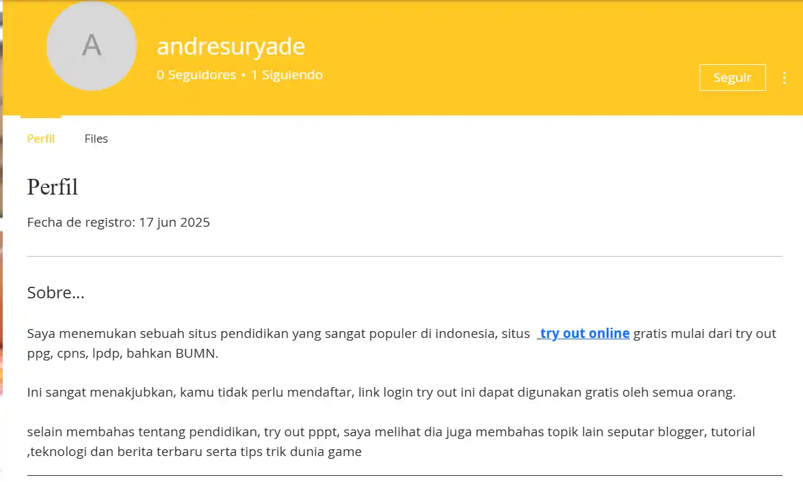
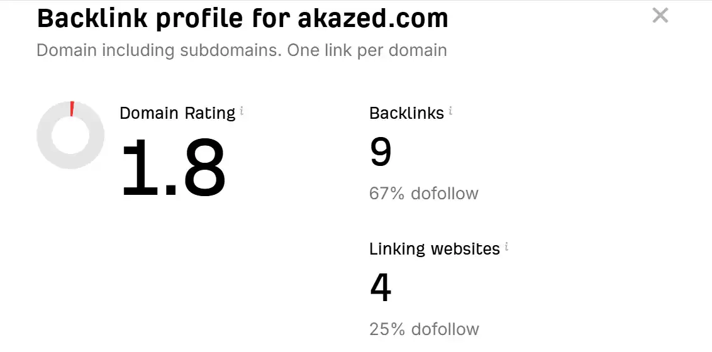
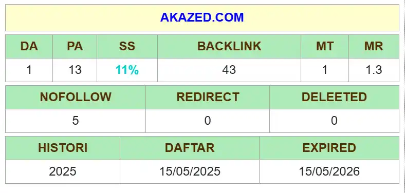

Salah satu kunci utama untuk mencapai hal tersebut adalah melalui optimasi SEO yang efektif, dan di dalamnya, strategi SEO Off-Page melalui pembangunan backlink memegang peranan yang sangat penting.

Di antara berbagai jenis backlink, **backlink EDU** sering diagung-agungnya para pakar SEO atau blogger. Tapi, apakah kamu tahu bagaimana *[cara mendapatkan backlink EDU gratis 2025](/cara-mendapatkan-backlink-edu-gratis/)* untuk meningkatkan peringkat website kamu? Mari kita selami lebih dalam.

## Apa Itu Backlink EDU dan Mengapa Sangat Penting?

**[Backlink EDU](/cara-mendapatkan-backlink-edu-gratis/)** adalah tautan balik yang berasal dari domain website pendidikan (.edu). Website dengan domain .edu biasanya adalah institusi pendidikan seperti universitas, sekolah, atau lembaga riset. Google memberikan otoritas yang sangat tinggi pada situs-situs ini karena kredibilitas dan kekamulan informasi yang mereka berikan.

Mendapatkan backlink pendidikan dari situs-situs ini seperti mendapatkan stempel persetujuan dari otoritas tertinggi di mata Google. Ini secara signifikan dapat meningkatkan **Domain Authority (DA)** dan **Page Authority (PA)** website kamu, yang pada gilirannya akan mendorong peringkat website kamu di hasil pencarian.

Backlink EDU sangat efektif untuk **SEO Off-Page** dan merupakan bagian krusial dari strategi backlink yang solid. Terutama untuk *[blogger](/categories/blogger/)* baru mengembangkan situsnya.

## Apakah Backlink EDU Masih Efektif untuk SEO di Tahun 2025?

Pertanyaan ini sering muncul di benak para praktisi SEO. Jawabannya adalah: **YA**, backlink EDU masih efektif untuk *[SEO di tahun 2025](/)*, bahkan mungkin lebih penting dari sebelumnya.

Algoritma Google terus berkembang, namun prinsip dasar otoritas dan relevansi tetap menjadi pilar utama. Situs .edu tetap dianggap sebagai sumber informasi yang sangat terpercaya, sehingga tautan dari mereka akan selalu bernilai tinggi.

## Cara Mendapatkan Backlink EDU Gratis di Tahun 2025

Mendapatkan backlink gratis dari situs EDU memang tidak semudah membalik telapak tangan, namun bukan berarti tidak mungkin. Berikut adalah beberapa metode yang terbukti efektif:

### 1. Beasiswa atau Sponsorship

Banyak universitas memiliki halaman khusus untuk daftar beasiswa atau sponsor. Jika kamu memiliki program beasiswa atau kegiatan sosial yang relevan, kamu bisa menawarkan beasiswa kepada mahasiswa atau mensponsori acara kampus. Sebagai imbalannya, kamu mungkin bisa mendapatkan tautan balik dari halaman tersebut.

### 2. Konten Berkualitas Tinggi yang Relevan

Buatlah konten yang sangat informatif, mendalam, dan relevan dengan topik akademik atau penelitian. Contohnya:

- Infografis
- Studi kasus
- Hasil riset
- Panduan komprehensif

Jika konten kamu luar biasa, institusi pendidikan mungkin akan mengutip atau menautkannya sebagai referensi.

### 3. Sumber Daya Mahasiswa atau Alumni

Beberapa universitas memiliki halaman sumber daya untuk mahasiswa atau alumni. Jika kamu menawarkan diskon khusus, program magang, atau layanan relevan, kamu bisa menghubungi pihak universitas agar situs kamu dicantumkan di halaman tersebut.

### 4. Komentar Blog atau Forum Pendidikan

Walaupun seringkali hanya memberikan backlink **nofollow**, partisipasi aktif dalam blog atau forum institusi pendidikan bisa membangun hubungan dan visibilitas. Fokuslah pada kualitas komentar.

### 5. Direktori Alumni atau Departemen

Jika kamu adalah alumni, periksa apakah ada direktori alumni online. Beberapa departemen juga memiliki halaman mitra atau kolaborator yang bisa kamu manfaatkan.

### 6. Broken Link Building di Situs .EDU

Strategi lanjutan ini sangat efektif. Gunakan tool SEO untuk mencari tautan rusak di situs .edu. Setelah menemukan tautan yang relevan:

1. Buat konten pengganti yang lebih baik
2. Hubungi webmaster situs
3. Tawarkan konten kamu sebagai pengganti

## Manfaat Backlink EDU untuk SEO Website

Mendapatkan backlink EDU bukan hanya soal peringkat. Berikut adalah manfaat lainnya:

- **Peningkatan Otoritas Domain (DA & PA)**
- **Peringkat Kata Kunci Lebih Baik**
- **Trafik Organik Lebih Banyak**
- **Proses Indeks Google Lebih Cepat**
- **Meningkatkan Kepercayaan Pengguna**

## Berapa Banyak Backlink EDU yang Dibutuhkan untuk Ranking?

Tidak ada angka pasti. **Kualitas jauh lebih penting dari kuantitas.** Satu backlink berkualitas dari universitas ternama bisa lebih berharga daripada puluhan backlink dari situs biasa.

## Jenis Backlink EDU Apa yang Paling Bagus?

Yang terbaik adalah backlink **dofollow** dan **relevan secara kontekstual**. Dofollow meneruskan "link juice", dan relevansi menjaga naturalitas tautan tersebut.

## List Backlink Edu Gratis 2025 Masih Aktif

>Berikut list domain edu gratis high DA PA 2025 yang bisa kamu gunakan

| No. | URL |
|-----|-----|
| 1 | `https://nationaldppcsc.cdc.gov/s/login/SelfRegister` |
| 2 | `http://socialtv.media.mit.edu/2014/03/building-television-communities.html?showComment=1638596771809#c230177856765097963` |
| 3 | `http://crpgsa.unm.edu/2008/10/wetland-restoration-best-alternative-to.html` |
| 4 | `http://wells-status.gsu.edu/2012/09/power-is-back.html?showComment=1638597009533#c135190622391231161` |
| 5 | `http://aprotec.uchile.cl/2018/10/profesionales-organizados-y-movilizados.html?showComment=1638597028260#c1131901252714621040` |
| 6 | `http://studentambassadors.blog.jyu.fi/2018/12/student-tutor.html?showComment=1638597051126#c2964899314185358812` |
| 7 | `http://sheffield2013.blogs.latrobe.edu.au/2013/06/i-am-starting-to-get-into-somewhat-of.html?showComment=1638597094622#c3090329964390783940` |
| 8 | `https://smartcity.kaist.ac.kr/2017/10/kaist-urban-forum.html?showComment=1638597151655#c3176793862331507028` |
| 9 | `http://family.blog.hofstra.edu/2012/12/helpful-hints-for-getting-your-student.html?showComment=1638597178553#c6714159000829280750` |
| 10 | `http://healthyeating.sunnybrook.ca/2013/02/take-it-with-grain-of-salt-or-not.html?showComment=1638597296357#c5303008772215382866` |
| 11 | `http://blog.mohe.gov.my/2012/11/35-ipt-cemerlang.html?showComment=1638596573758#c4893156193394557936` |
| 12 | `http://natetaris.wheatoncollege.edu/2015/12/blog-post_10.html?showComment=1638597316735#c5128466059673669674` |
| 13 | `https://itnews.csuci.edu/2019/03/amazon-web-services-aws-webinars-from.html?showComment=1638597327376#c3779993979232858000` |
| 14 | `http://eventsblog.boa.ac.uk/2011/10/bristol-hip-meeting-1-2-december-2011.html?showComment=1638600302642#c4089917944498025512` |
| 15 | `http://connect.qmu.ac.uk/2010/05/growth-of-scottish-higher-education.html?showComment=1638600628359#c6431125704036015756` |
| 16 | `http://fki.bem.ums.ac.id/2017/08/dresscode-untuk-peserta-fakultaria-fki.html?showComment=1638600647250#c5182874144822094491` |
| 17 | `http://dodgeball.ckps.hc.edu.tw/2012/11/blog-post_23.html?showComment=1638600652551#c3807305717108442063` |
| 18 | `http://ictblog.upsi.edu.my/2011/05/assalamualaikum-adalah-dimaklumkan.html?showComment=1638601161982#c851040737292124246` |
| 19 | `https://newsroom.untirta.ac.id/2018/05/menjelang-lebaran-untirta-masih.html?showComment=1638601186868#c4273195077397754748` |

## Update Backlink EDU Gratis 2025

Masih kurang dengan daftar link backlink edu hight DA PA di atas? Beberapa hari lalu saya kembali menemukan beberapa backlink edu gratis lagi.

Lebih tepatnya *Backlink profil edu*, jadi di sini kita bisa membuat halaman profil dan menautkan ke halaman website kita seperti biasa. 

>Backlink profil edu ini sangat berkualitas, tapi tetap harus bijak menggunakannya. 

Penasaran daftar backlink edu 2025 update dari akazed? Kamu bisa lihat contohnya ***[di sini](/friends/)*** 

Berikut daftar backlink profile edu dofollow yang masih aktif dan gratis untuk membuat profil edu.

| No. | Backlink Profile Edu Gratis 2025 (status aktif)                                                              |
| --- | ---------------------------------------------------------------- |
| 1   | `https://www.colegiodelabici.edu.co/profile/andresuryade57751/profile` |
| 2   | `https://www.ictae.edu.mx/profile/andresuryade94649/profile`      |
| 3   | `https://www.lanubedocente.21.edu.ar/profile/tryoutgratis71732/profile` |
| 4   | `https://www.nhat.thanhdong.edu.vn/profile/tryoutgratis7155/profile` |
| 5   | `https://www.cimurc.ba.gov.br/profile/tryoutgratis64364/profile`  |
| 6   | `https://www.centrotecnologico.edu.mx/profile/tryoutgratis61127/profile` |
| 7   | `https://www.woorips.vic.edu.au/profile/tryoutgratis56413/profile` |
| 8   | `https://www.colegioenlinea.edu.co/profile/tryoutgratis85817/profile` |
| 9   | `https://www.greenland.edu.hk/profile/tryoutgratis24653/profile`  |
| 10  | `https://www.stories.qct.edu.au/profile/tryoutgratis74114/profile` |
| 11  | `https://www.orkhonschool.edu.mn/profile/tryoutgratis93737/profile` |
| 12  | `https://www.medicineazhar.edu.eg/profile/tryoutgratis77859/profile` |
| 13  | `https://www.ceacuautla.edu.mx/profile/tryoutgratis62307/profile`  |
| 14  | `https://www.agastyaacademy.edu.in/profile/tryoutgratis54376/profile` |

*Backlink profile edu free dofollow* di atas bisa kamu daftarkan akun dan membuat link tautan di sana. 

  <!-- Banner Produk Statis --> 
 
 
  
 
 <h4 class="az-product-title" title="14 Backlink Profile Edu">14 Backlink Profile Edu</h4> 
backlink profile edu dofollow murah, tanpa capek buat sendiri.
 
 
 
 Rp 100.000 Rp 30.000 
 <a href="https://api.whatsapp.com/send?phone=6281374107656&text=Halo,%20Akazed.%20Saya%20tertarik%20memesan%2014%20Backlink%20Profile%20Edu%20Rp%2030.000" class="az-buy-button" target="_blank">Beli Sekarang !</a> 
 
 

### Cara Membuat Backlink Edu Gratis
Bagi kamu yang bingung, karena ini gratisan tentu kita tidak bisa membuat backlink di dalam artikel. Melainkan dengan memberikan komentar dan menyisipkan link atau url aktif. Caranya seperti dibawah 

## Dampak Penggunaan Backlink Edu
>Saya yakin, sebagai user dan seorang bloger berharap dengan menggunakan backlink edu ataupun backlink gov gratis bisa memberikan dampak positif terhadap blog. Memang ini tidak sepenuhnya salah, tapi mari kita bahas tentang hal ini.

### Dampak Positif Menggunakan Backlink Edu

1. ***Menaikkan Rating Domain :*** Tujuan utama tentu saja untuk mencoba menaikkan rating domain, yang katanya berpengaruh terhadap SEO dan Domain Authority. Tapi, setelah mencobanya menurut saya gak berdampak sebesar dan sebagus apa yang diharapkan kok. *Akazed membuat 9 backlink* namun hanya memberikan 1.3 domain rating
2. ***Menaikkan Domain Authority (DA) dan Page authority (PA) blog***, DA PA blog yang tinggi masih menjadi acuan para blogger bahkan praktisi SEO sampai saat ini. Salah satu cara cepat menaikkan DA PA blog tentu saja dengan ***menanam backlink kontekstual*** yang baik. perlu digaris bawahi, yang dibutuhkan adalah backlink yang benar-benar natural, bukan sekadar spam link sana sini yang malah berdampak buruk terhadap SEO, dan menaikkan SPAM Score blog.

### Dampak Negatif Menggunakan Backlink Edu
Sejujurnya, menggunakan backlink dofollow edu sangat bermanfaat untuk blog, karena kita tahu situs edukasi, baik dengan domain .edu, .sch.id memiliki kredibilitas yang lebih tinggi, tapi harus tetap sesuai konteks. 

>Jika mempertanyakan dampak negatif backlink edu apa sih? 

 ***Menaikkan SPAM Score*** : Salah satu kesalahan fatal saya memulai ngeblog kembali adalah tidak membaca pembaharuan google spam. Yap, 2018-2019 silam menaikkan DA PA Blog sangat mudah tanpa khawatir dengan spam score, bahkan dengan backlink redirect memberikan point yang besar. Perhatikan nilai DA PA SS domain akazed berikut

Kaget sih, SS (Spam Score) naik tiba-tiba jadi 11%, terlebih lagi penilaian MOZ ini akan update entah 3 bulan sekali, sehingga langkah saat ini tentu saja terus update blog dengan kualitas konten lebih baik.

>Tapi, perlu diperhatkan ***Penggunaan backlink edu yang tepat*** tidak akan memberikan Spam Score seperti ini, misal membuat ulasan di situs edu bukan spam di komentar.

## Kesimpulan

Sebagai pilar utama **SEO Off-Page**, pembangunan backlink berkualitas — khususnya backlink EDU — adalah **investasi jangka panjang**. Dengan menerapkan strategi seperti:

- Membuat konten akademik berkualitas
- Menawarkan beasiswa
- Memanfaatkan broken link

kamu bisa meningkatkan **Domain Authority**, **Page Authority**, serta meningkatkan **trafik organik** ke website kamu. Fokus pada **kualitas dan relevansi** adalah kunci untuk mendapatkan backlink EDU gratis yang efektif di tahun 2025, memastikan situs kamu tetap kompetitif dan terpercaya di mata mesin pencari.

