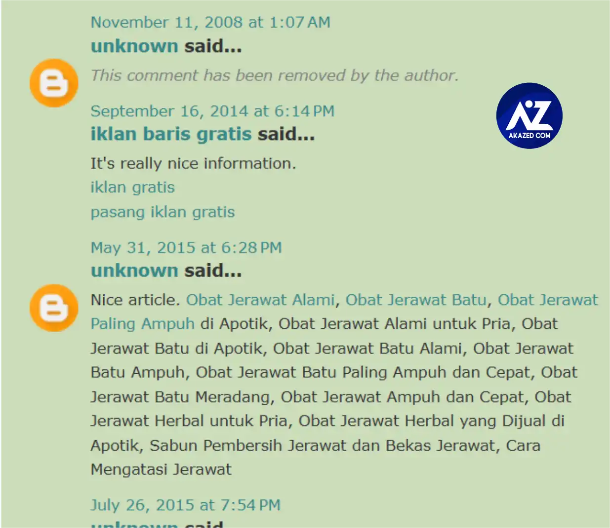

Salah satu kunci utama untuk mencapai hal tersebut adalah melalui optimasi SEO yang efektif, dan di dalamnya, strategi SEO Off-Page melalui pembangunan backlink memegang peranan yang sangat penting.

Di antara berbagai jenis backlink, **backlink EDU** sering diagung-agungnya para pakar SEO atau blogger. Tapi, apakah kamu tahu bagaimana *[cara mendapatkan backlink EDU gratis 2025](/cara-mendapatkan-backlink-edu-gratis/)* untuk meningkatkan peringkat website kamu? Mari kita selami lebih dalam.

## Apa Itu Backlink EDU dan Mengapa Sangat Penting?

**[Backlink EDU](/cara-mendapatkan-backlink-edu-gratis/)** adalah tautan balik yang berasal dari domain website pendidikan (.edu). Website dengan domain .edu biasanya adalah institusi pendidikan seperti universitas, sekolah, atau lembaga riset. Google memberikan otoritas yang sangat tinggi pada situs-situs ini karena kredibilitas dan kekamulan informasi yang mereka berikan.

Mendapatkan backlink pendidikan dari situs-situs ini seperti mendapatkan stempel persetujuan dari otoritas tertinggi di mata Google. Ini secara signifikan dapat meningkatkan **Domain Authority (DA)** dan **Page Authority (PA)** website kamu, yang pada gilirannya akan mendorong peringkat website kamu di hasil pencarian.

Backlink EDU sangat efektif untuk **SEO Off-Page** dan merupakan bagian krusial dari strategi backlink yang solid. Terutama untuk *[blogger](/categories/blogger/)* baru mengembangkan situsnya.

## Apakah Backlink EDU Masih Efektif untuk SEO di Tahun 2025?

Pertanyaan ini sering muncul di benak para praktisi SEO. Jawabannya adalah: **YA**, backlink EDU masih efektif untuk *[SEO di tahun 2025](/)*, bahkan mungkin lebih penting dari sebelumnya.

Algoritma Google terus berkembang, namun prinsip dasar otoritas dan relevansi tetap menjadi pilar utama. Situs .edu tetap dianggap sebagai sumber informasi yang sangat terpercaya, sehingga tautan dari mereka akan selalu bernilai tinggi.

## Cara Mendapatkan Backlink EDU Gratis di Tahun 2025

Mendapatkan backlink gratis dari situs EDU memang tidak semudah membalik telapak tangan, namun bukan berarti tidak mungkin. Berikut adalah beberapa metode yang terbukti efektif:

### 1. Beasiswa atau Sponsorship

Banyak universitas memiliki halaman khusus untuk daftar beasiswa atau sponsor. Jika kamu memiliki program beasiswa atau kegiatan sosial yang relevan, kamu bisa menawarkan beasiswa kepada mahasiswa atau mensponsori acara kampus. Sebagai imbalannya, kamu mungkin bisa mendapatkan tautan balik dari halaman tersebut.

### 2. Konten Berkualitas Tinggi yang Relevan

Buatlah konten yang sangat informatif, mendalam, dan relevan dengan topik akademik atau penelitian. Contohnya:

- Infografis
- Studi kasus
- Hasil riset
- Panduan komprehensif

Jika konten kamu luar biasa, institusi pendidikan mungkin akan mengutip atau menautkannya sebagai referensi.

### 3. Sumber Daya Mahasiswa atau Alumni

Beberapa universitas memiliki halaman sumber daya untuk mahasiswa atau alumni. Jika kamu menawarkan diskon khusus, program magang, atau layanan relevan, kamu bisa menghubungi pihak universitas agar situs kamu dicantumkan di halaman tersebut.

### 4. Komentar Blog atau Forum Pendidikan

Walaupun seringkali hanya memberikan backlink **nofollow**, partisipasi aktif dalam blog atau forum institusi pendidikan bisa membangun hubungan dan visibilitas. Fokuslah pada kualitas komentar.

### 5. Direktori Alumni atau Departemen

Jika kamu adalah alumni, periksa apakah ada direktori alumni online. Beberapa departemen juga memiliki halaman mitra atau kolaborator yang bisa kamu manfaatkan.

### 6. Broken Link Building di Situs .EDU

Strategi lanjutan ini sangat efektif. Gunakan tool SEO untuk mencari tautan rusak di situs .edu. Setelah menemukan tautan yang relevan:

1. Buat konten pengganti yang lebih baik
2. Hubungi webmaster situs
3. Tawarkan konten kamu sebagai pengganti

## Manfaat Backlink EDU untuk SEO Website

Mendapatkan backlink EDU bukan hanya soal peringkat. Berikut adalah manfaat lainnya:

- **Peningkatan Otoritas Domain (DA & PA)**
- **Peringkat Kata Kunci Lebih Baik**
- **Trafik Organik Lebih Banyak**
- **Proses Indeks Google Lebih Cepat**
- **Meningkatkan Kepercayaan Pengguna**

## Berapa Banyak Backlink EDU yang Dibutuhkan untuk Ranking?

Tidak ada angka pasti. **Kualitas jauh lebih penting dari kuantitas.** Satu backlink berkualitas dari universitas ternama bisa lebih berharga daripada puluhan backlink dari situs biasa.

## Jenis Backlink EDU Apa yang Paling Bagus?

Yang terbaik adalah backlink **dofollow** dan **relevan secara kontekstual**. Dofollow meneruskan "link juice", dan relevansi menjaga naturalitas tautan tersebut.

## List Backlink Edu Gratis 2025 Masih Aktif
>Berikut list domain edu gratis high DA PA 2025 yang bisa kamu gunakan

| No. | URL |
|-----|-----|
| 1 | https://nationaldppcsc.cdc.gov/s/login/SelfRegister |
| 2 | http://socialtv.media.mit.edu/2014/03/building-television-communities.html?showComment=1638596771809#c230177856765097963 |
| 3 | http://crpgsa.unm.edu/2008/10/wetland-restoration-best-alternative-to.html |
| 4 | http://wells-status.gsu.edu/2012/09/power-is-back.html?showComment=1638597009533#c135190622391231161 |
| 5 | http://aprotec.uchile.cl/2018/10/profesionales-organizados-y-movilizados.html?showComment=1638597028260#c1131901252714621040 |
| 6 | http://studentambassadors.blog.jyu.fi/2018/12/student-tutor.html?showComment=1638597051126#c2964899314185358812 |
| 7 | http://sheffield2013.blogs.latrobe.edu.au/2013/06/i-am-starting-to-get-into-somewhat-of.html?showComment=1638597094622#c3090329964390783940 |
| 8 | https://smartcity.kaist.ac.kr/2017/10/kaist-urban-forum.html?showComment=1638597151655#c3176793862331507028 |
| 9 | http://family.blog.hofstra.edu/2012/12/helpful-hints-for-getting-your-student.html?showComment=1638597178553#c6714159000829280750 |
| 10 | http://healthyeating.sunnybrook.ca/2013/02/take-it-with-grain-of-salt-or-not.html?showComment=1638597296357#c5303008772215382866 |
| 11 | http://blog.mohe.gov.my/2012/11/35-ipt-cemerlang.html?showComment=1638596573758#c4893156193394557936 |
| 12 | http://natetaris.wheatoncollege.edu/2015/12/blog-post_10.html?showComment=1638597316735#c5128466059673669674 |
| 13 | https://itnews.csuci.edu/2019/03/amazon-web-services-aws-webinars-from.html?showComment=1638597327376#c3779993979232858000 |
| 14 | http://eventsblog.boa.ac.uk/2011/10/bristol-hip-meeting-1-2-december-2011.html?showComment=1638600302642#c4089917944498025512 |
| 15 | http://connect.qmu.ac.uk/2010/05/growth-of-scottish-higher-education.html?showComment=1638600628359#c6431125704036015756 |
| 16 | http://fki.bem.ums.ac.id/2017/08/dresscode-untuk-peserta-fakultaria-fki.html?showComment=1638600647250#c5182874144822094491 |
| 17 | http://dodgeball.ckps.hc.edu.tw/2012/11/blog-post_23.html?showComment=1638600652551#c3807305717108442063 |
| 18 | http://ictblog.upsi.edu.my/2011/05/assalamualaikum-adalah-dimaklumkan.html?showComment=1638601161982#c851040737292124246 |
| 19 | https://newsroom.untirta.ac.id/2018/05/menjelang-lebaran-untirta-masih.html?showComment=1638601186868#c4273195077397754748 |

### Cara Membuat Backlink Edu Gratis
Bagi kamu yang bingung, karena ini gratisan tentu kita tidak bisa membuat backlink di dalam artikel. Melainkan dengan memberikan komentar dan menyisipkan link atau url aktif. Caranya seperti dibawah 

## Kesimpulan

Sebagai pilar utama **SEO Off-Page**, pembangunan backlink berkualitas — khususnya backlink EDU — adalah **investasi jangka panjang**. Dengan menerapkan strategi seperti:

- Membuat konten akademik berkualitas
- Menawarkan beasiswa
- Memanfaatkan broken link

kamu bisa meningkatkan **Domain Authority**, **Page Authority**, serta meningkatkan **trafik organik** ke website kamu. Fokus pada **kualitas dan relevansi** adalah kunci untuk mendapatkan backlink EDU gratis yang efektif di tahun 2025, memastikan situs kamu tetap kompetitif dan terpercaya di mata mesin pencari.
