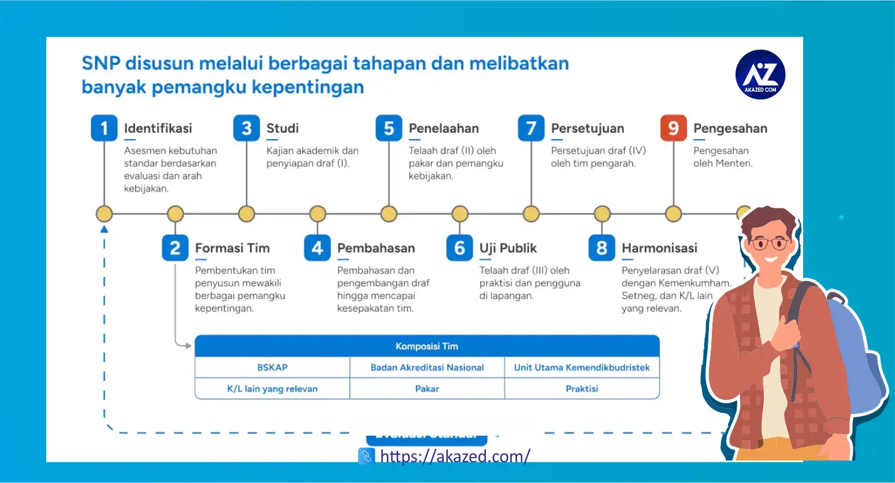

> <a href="https://chat.whatsapp.com/CxtsSVXqIw4IUdnxAor0of" class="button add-to-cart">GABUNG GROUP INFO PPG 2025 SEKARANG</a>  
## Mengapa Guru Wajib Ikut PPG? Pentingnya Sertifikasi Guru untuk Karir dan Kualitas Pendidikan Nasional

Pernahkah Anda bertanya-tanya, apa yang sebenarnya membedakan guru biasa dengan guru profesional sejati? Di era digital ini, tuntutan terhadap kualitas guru semakin tinggi. Kita semua tahu, guru adalah ujung tombak *[pendidikan](/categories/pendidikan/)*, kunci masa depan bangsa. Tapi, apakah cukup hanya punya gelar sarjana untuk jadi guru yang hebat?

Nah, di sinilah **[Pendidikan Profesi Guru (PPG)](/categories/ppg/)** dan **Sertifikasi Guru** berperan penting. Dua hal ini bukan lagi sekadar pilihan, melainkan sebuah **kewajiban bagi guru** di Indonesia. Pemerintah serius ingin meningkatkan **mutu pendidikan** kita, dan salah satu caranya adalah dengan memastikan setiap guru memiliki standar kompetensi yang mumpuni.

Melalui artikel ini, kita akan mengupas tuntas mengapa **guru wajib ikut PPG**, apa saja **manfaat PPG bagi guru**, dan seberapa **[pentingnya sertifikasi guru](/pentingnya-sertifikasi-guru/)** untuk karir dan kesejahteraan mereka, serta bagaimana semua ini berdampak pada **kualitas pendidikan nasional** secara keseluruhan. Yuk, kita selami lebih dalam!

---

## Apa Itu PPG dan Sertifikasi Guru? Memahami Dasar-dasarnya

Sebelum jauh membahas mengapa ini menjadi kewajiban, mari kita pahami dulu apa sebenarnya **Pendidikan Profesi Guru** dan *[apa itu PPG](/mengenal-apa-itu-ppg-guru/)* atau**sertifikasi guru**.

### Membedah Pendidikan Profesi Guru (PPG)

Secara sederhana, **PPG Guru** adalah program pendidikan lanjutan yang dirancang khusus untuk mempersiapkan lulusan sarjana (S1) atau D4 agar memiliki kompetensi sebagai guru profesional. Bayangkan begini: jika Anda lulusan S1 teknik, Anda butuh sertifikasi keahlian untuk diakui sebagai insinyur profesional, kan? Nah, PPG ini fungsinya mirip, tapi untuk profesi guru.

Program ini bertujuan untuk membekali calon guru dengan empat pilar **kompetensi guru** utama:
* **Kompetensi Pedagogik:** Kemampuan mengelola pembelajaran peserta didik, mulai dari merancang, melaksanakan, hingga mengevaluasi pembelajaran.
* **Kompetensi Profesional:** Penguasaan materi pembelajaran secara luas dan mendalam. Ini termasuk penguasaan kurikulum dan substansi keilmuan yang relevan.
* **Kompetensi Kepribadian:** Kemampuan personal yang mencerminkan kepribadian yang mantap, stabil, dewasa, arif, berwibawa, menjadi teladan bagi peserta didik, dan berakhlak mulia.
* **Kompetensi Sosial:** Kemampuan berkomunikasi dan berinteraksi secara efektif dan santun dengan peserta didik, sesama pendidik, tenaga kependidikan, orang tua/wali, dan masyarakat sekitar.

Di Indonesia, ada dua jalur utama dalam **program PPG**:
1.  **PPG Prajabatan:** Ini untuk Anda yang *belum* menjadi guru. Anda baru lulus S1 non-kependidikan atau kependidikan dan ingin langsung berkarir sebagai guru profesional. Program ini biasanya lebih komprehensif, mencakup perkuliahan intensif dan praktik mengajar di sekolah.
2.  **PPG Dalam Jabatan (Daljab):** Nah, kalau ini khusus untuk Anda yang *sudah* menjadi guru (baik honorer maupun PNS), namun *belum* memiliki **sertifikat pendidik**. Program ini seringkali disesuaikan dengan pengalaman mengajar yang sudah dimiliki guru.

### Memahami Sertifikasi Guru

Setelah Anda berhasil menyelesaikan program **Pendidikan Profesi Guru**, Anda akan mengikuti Uji Kompetensi Mahasiswa PPG (UKMPPG). Jika dinyatakan lulus, barulah Anda akan mendapatkan **Sertifikat Pendidik**.

Jadi, **sertifikasi guru** adalah bentuk pengakuan resmi dari pemerintah atas profesionalisme seorang guru yang telah memenuhi standar kompetensi yang ditetapkan. Ini seperti lisensi praktik bagi seorang dokter atau pengacara. Dengan memiliki **sertifikat pendidik**, Anda tidak hanya diakui keahliannya, tetapi juga dijamin bahwa Anda memenuhi standar kualitas nasional yang diharapkan dari seorang pendidik.

## Mengapa Guru Wajib Ikut PPG? Manfaat Esensial yang Tak Terbantahkan

Oke, ini dia bagian intinya! Mengapa sih semua guru, baik yang baru mau mengajar maupun yang sudah lama berkecimpung di dunia pendidikan, **wajib PPG** dan punya sertifikat pendidik? Ada banyak **manfaat PPG bagi guru** yang sangat esensial dan tak bisa diabaikan. 

>Oh ya, bagi kamu calon guru jangan lupa selalu pantau kapan *[jadwal ppg dibuka](jadwal-ppg-2025-kapan-dibuka/)

### 1. Peningkatan Kompetensi Profesional yang Terukur

Ini adalah alasan utama mengapa **PPG Guru** diwajibkan. Dunia pendidikan terus bergerak maju. Metode mengajar yang dulu efektif, mungkin kini perlu disesuaikan. Siswa masa kini punya gaya belajar yang berbeda. Nah, PPG hadir untuk:

* **Mengasah Keterampilan Mengajar:** Di PPG, Anda tidak hanya diajari teori, tapi juga praktik. Anda akan belajar strategi pembelajaran inovatif, bagaimana memanfaatkan teknologi dalam kelas (misalnya, membuat presentasi interaktif atau menggunakan aplikasi pembelajaran), cara mengelola kelas yang dinamis, hingga teknik penilaian yang akurat.
* **Memperdalam Penguasaan Materi:** Meskipun Anda sudah sarjana di bidang studi tertentu, PPG akan membantu Anda memperdalam materi tersebut dari sudut pandang keguruan, bagaimana menyampaikannya agar mudah dipahami siswa, dan bagaimana mengaitkannya dengan kehidupan sehari-hari.
* **Membangun Sikap dan Etika Guru:** PPG juga membentuk karakter Anda sebagai pendidik. Anda akan dibimbing untuk menjadi guru yang berintegritas, punya empati, dan menjadi teladan bagi siswa. Ini semua termasuk dalam pengembangan **profesionalisme guru**.

Dengan kompetensi yang terus diasah ini, Anda akan menjadi guru yang lebih percaya diri, inovatif, dan mampu menciptakan pengalaman belajar yang menyenangkan dan efektif bagi siswa. Ini secara langsung berkontribusi pada **kualitas pembelajaran**.

### 2. Pemenuhan Standar Nasional Guru dan Kualitas Pendidikan

Pemerintah punya standar tertentu untuk profesi guru, dan **PPG** adalah jalur resmi untuk memenuhi standar tersebut. Ibarat sebuah produk, ada SNI (Standar Nasional Indonesia) yang menjamin kualitasnya. Nah, **sertifikasi guru** adalah jaminan bahwa seorang guru sudah memenuhi "SNI" untuk pendidik.

Ketika mayoritas guru di sebuah negara sudah bersertifikasi, itu artinya **mutu pendidikan** secara keseluruhan akan meningkat. Kita bisa membayangkan, jika semua guru memiliki standar kompetensi yang sama tingginya, tidak akan ada lagi kesenjangan kualitas antara sekolah di kota besar dengan sekolah di pelosok. Ini adalah langkah krusial untuk mewujudkan cita-cita **pendidikan nasional yang berkualitas**.

### 3. Peluang Pengembangan Karir Lebih Baik (Kenaikan Pangkat Guru!)

Ini adalah salah satu **manfaat PPG** yang paling dirasakan langsung oleh para guru. Memiliki **sertifikat pendidik** akan membuka banyak pintu **prospek karir guru** yang lebih cerah:

* **Peluang Kerja Lebih Luas:** Banyak sekolah, terutama sekolah negeri, mensyaratkan calon gurunya memiliki sertifikat pendidik. Dengan sertifikasi, Anda menjadi kandidat yang lebih menarik dan punya nilai jual tinggi di pasar kerja.
* **Kenaikan Pangkat dan Jabatan Fungsional:** Bagi guru Pegawai Negeri Sipil (PNS), sertifikasi pendidik adalah salah satu syarat utama untuk kenaikan pangkat dan golongan. Ini juga mempermudah Anda untuk mengisi jabatan fungsional yang lebih tinggi atau posisi strategis di sekolah. Jadi, bagi Anda yang punya ambisi untuk **kenaikan pangkat guru**, **PPG** adalah langkah wajib.
* **Pengakuan sebagai Guru Profesional:** Anda tidak lagi hanya disebut "guru," melainkan "guru profesional." Pengakuan ini membawa prestise dan rasa bangga tersendiri dalam menjalani **profesi guru** yang mulia ini.

### 4. Peningkatan Kesejahteraan Guru Melalui Tunjangan Profesi Guru (TPG)

Siapa yang tidak ingin hidup sejahtera? Nah, ini adalah salah satu **manfaat PPG** yang paling konkret. Guru yang telah memiliki **sertifikat pendidik** berhak mendapatkan **Tunjangan Profesi Guru (TPG)**. Besaran TPG ini setara dengan satu kali gaji pokok guru yang bersangkutan dan diberikan setiap bulan.

Bisa dibayangkan, adanya TPG ini secara signifikan akan meningkatkan **kesejahteraan guru** dan keluarga. Ini adalah bentuk apresiasi pemerintah atas dedikasi dan profesionalisme guru. Jadi, **hubungan PPG dan kesejahteraan guru** sangatlah erat dan langsung. Ini juga salah satu **alasan guru wajib punya sertifikat pendidik**!

### 5. Legalitas dan Regulasi Pemerintah: Sebuah Keharusan Hukum

Kewajiban untuk memiliki **sertifikat pendidik** bagi guru ini bukan isapan jempol belaka. Ada dasar hukum dan regulasi yang mengaturnya. Misalnya, Undang-Undang Nomor 14 Tahun 2005 tentang Guru dan Dosen secara jelas menyatakan bahwa guru wajib memiliki kualifikasi akademik, kompetensi, sertifikat pendidik, sehat jasmani dan rohani, serta memiliki kemampuan untuk mewujudkan tujuan pendidikan nasional.

Artinya, jika Anda ingin menjadi guru yang diakui secara legal dan formal di Indonesia, memiliki **sertifikat pendidik** adalah sebuah keharusan. **Aturan baru tentang kewajiban PPG guru** ini terus dipertegas untuk memastikan kualitas tenaga pendidik. Implikasinya, guru yang belum bersertifikat mungkin akan menghadapi batasan dalam karir atau bahkan tidak bisa mengajar di institusi pendidikan formal tertentu.

---

## Pentingnya Sertifikasi Guru bagi Ekosistem Pendidikan yang Lebih Luas

*[Daftar ppg](/cara-daftar-ppg-prajab-2025/)* Selain manfaat langsung bagi guru, **sertifikasi guru** juga memiliki dampak positif yang sangat besar bagi seluruh ekosistem pendidikan.

### 1. Peningkatan Kualitas Pembelajaran di Kelas

Guru yang bersertifikasi cenderung lebih siap, lebih inovatif, dan lebih efektif dalam menyampaikan materi pelajaran. Mereka dibekali dengan berbagai strategi untuk menghadapi berbagai karakter siswa, mengelola kelas dengan baik, dan menciptakan suasana belajar yang kondusif. Dampaknya, **kualitas pembelajaran** di kelas akan meningkat, siswa lebih termotivasi, dan hasil belajar mereka pun diharapkan akan lebih baik. Ini adalah **dampak sertifikasi guru terhadap kualitas pendidikan** yang paling nyata.

### 2. Membangun Kepercayaan Publik dan Orang Tua

Orang tua tentu ingin yang terbaik untuk anak-anaknya. Ketika mereka tahu bahwa guru yang mengajar anak-anaknya adalah guru yang sudah bersertifikasi, itu akan membangun rasa percaya dan keyakinan terhadap kualitas pendidikan yang diberikan sekolah. **Sertifikasi guru** menjadi semacam jaminan kualitas bagi publik, meningkatkan citra **profesi guru** secara keseluruhan.

### 3. Penguatan Profesionalisme Profesi Guru

**Sertifikasi guru** mengangkat harkat dan martabat **profesi guru** dari sekadar pekerjaan menjadi sebuah profesi yang terhormat, akuntabel, dan diakui secara nasional. Ini mendorong guru untuk terus mengembangkan diri, mengikuti **Pengembangan Keprofesian Berkelanjutan (PKB)**, dan selalu *up-to-date* dengan perkembangan ilmu pendidikan. Ini juga menjadi **fungsi sertifikasi guru dalam sistem pendidikan** kita.

### 4. Mewujudkan Pendidikan Nasional yang Berkualitas

Pada akhirnya, semua upaya ini bermuara pada satu tujuan besar: **mewujudkan pendidikan nasional yang berkualitas**. Dengan memiliki guru-guru yang profesional, kompeten, dan sejahtera, fondasi pendidikan akan semakin kuat. Kita bisa berharap lebih banyak generasi muda yang cerdas, kreatif, dan berakhlak mulia lahir dari sistem pendidikan yang didukung oleh guru-guru bersertifikat. Ini adalah salah satu **tujuan utama Pendidikan Profesi Guru**.

---

## Tantangan dan Solusi dalam Implementasi PPG & Sertifikasi

Tentu saja, perjalanan menuju 100% guru bersertifikat tidak lepas dari tantangan.

### Tantangan yang Mungkin Dihadapi:

* **Jumlah Guru yang Belum Bersertifikat:** Masih banyak guru yang belum memiliki sertifikat pendidik, terutama guru-guru honorer di daerah terpencil.
* **Akses PPG di Daerah Terpencil:** Akses informasi dan fasilitas untuk mengikuti PPG, terutama di daerah pelosok, mungkin masih menjadi kendala.
* **Biaya atau Kuota PPG:** Meskipun pemerintah memberikan beasiswa atau subsidi, biaya hidup selama PPG atau kuota yang terbatas bisa menjadi tantangan bagi sebagian calon peserta.
* **Uji Kompetensi yang Ketat:** Uji Kinerja (UKin) dan Uji Pengetahuan (UP) di akhir PPG menuntut persiapan yang serius dan bisa menjadi momok bagi sebagian peserta.

### Solusi dan Harapan:

Pemerintah dan Lembaga Pendidikan Tenaga Kependidikan (LPTK) terus berupaya mencari solusi:
* **Peningkatan Kuota PPG:** Pembukaan kuota **PPG** secara berkala dan dengan jumlah yang lebih besar.
* **Model Pembelajaran Fleksibel:** Pengembangan **modul PPG** dan kurikulum yang bisa diakses secara daring (*online*) untuk mempermudah akses guru di berbagai daerah.
* **Afirmasi untuk Daerah Tertentu:** Memberikan prioritas atau afirmasi bagi guru-guru dari daerah 3T (Terdepan, Terluar, Tertinggal).
* **Dukungan LPTK:** **Dosen PPG** dan LPTK terus berinovasi dalam metode pembelajaran dan pendampingan untuk memastikan kelulusan peserta.
* **Sosialisasi dan Pendampingan:** Mengadakan sosialisasi yang masif dan memberikan pendampingan bagi guru-guru yang akan mengikuti PPG.

---

## Kesimpulan: Saatnya Jadi Guru Profesional Idaman!

Kita telah melihat bahwa **Pendidikan Profesi Guru (PPG)** dan **sertifikasi guru** adalah pilar penting dalam mewujudkan pendidikan berkualitas di Indonesia. Ini bukan sekadar formalitas, melainkan sebuah investasi besar untuk **profesi guru** itu sendiri, untuk karir Anda, kesejahteraan Anda, dan yang terpenting, untuk masa depan anak-anak bangsa.

Dengan memiliki **sertifikat pendidik** dari **program PPG**, Anda akan menjadi guru yang lebih **kompeten**, lebih profesional, lebih sejahtera, dan diakui secara nasional. Ini membuka pintu **prospek karir guru** yang lebih cerah, mulai dari **kenaikan pangkat guru** hingga peluang menjadi pemimpin di institusi pendidikan.

Bagi Anda yang belum bersertifikat, jangan tunda lagi! Segera cari informasi mengenai **syarat mengikuti PPG**, baik **PPG Prajabatan** maupun **PPG Dalam Jabatan**. Ini adalah kesempatan emas untuk meningkatkan kualitas diri dan memberikan kontribusi terbaik bagi **dunia pendidikan** kita.

Mari bersama wujudkan guru-guru profesional yang siap mencetak generasi emas bangsa! Jadilah bagian dari perubahan positif di **dunia pendidikan**.

---

## FAQ (Pertanyaan yang Sering Diajukan)

### Apa itu PPG Daljab?
**PPG Daljab** adalah singkatan dari **Pendidikan Profesi Guru Dalam Jabatan**, yaitu program PPG yang diperuntukkan bagi guru yang sudah mengajar namun belum memiliki **sertifikat pendidik**.

### Apakah semua guru wajib ikut PPG?
Ya, berdasarkan Undang-Undang Nomor 14 Tahun 2005 tentang Guru dan Dosen, guru wajib memiliki **sertifikat pendidik**. Oleh karena itu, **PPG Guru** menjadi jalur resmi untuk mendapatkan sertifikasi tersebut.

### Apa manfaat utama sertifikasi guru?
Manfaat utamanya adalah pengakuan profesionalisme, peningkatan **kompetensi guru**, peluang **kenaikan pangkat guru** dan karir yang lebih baik, serta hak mendapatkan **Tunjangan Profesi Guru (TPG)** yang meningkatkan **kesejahteraan guru**.

### Berapa lama proses PPG?
Durasi **program PPG** bervariasi. Untuk **PPG Prajabatan**, biasanya sekitar 2 semester (1 tahun). Sedangkan **PPG Dalam Jabatan** bisa lebih bervariasi tergantung model dan kebijakan yang berlaku.

### Apakah sertifikasi guru menjamin kenaikan gaji?
Sertifikasi guru secara langsung menjamin Anda berhak mendapatkan **Tunjangan Profesi Guru (TPG)** yang besarnya setara dengan satu kali gaji pokok. Ini secara signifikan meningkatkan penghasilan bulanan Anda. Untuk kenaikan gaji pokok itu sendiri biasanya mengikuti jenjang kepangkatan atau golongan.

