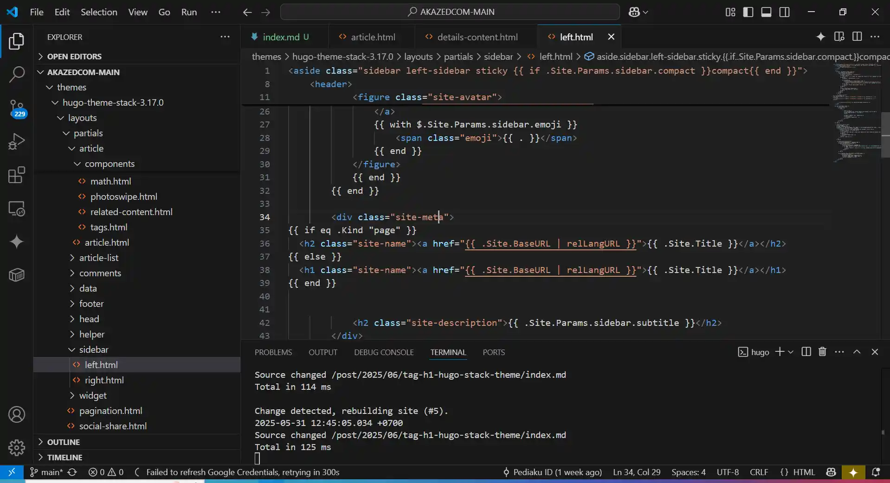

Bagi pengguna template *hugo stack theme* mungkin akan mengalami masalah *issue* ini, yaitu tag h1 yang muncul tidak seperti yang diharapkan. Maksud saya adalah, pada tema hugo stack theme, dalam halaman postingan yang menjadi H1 adalah title blog, sementara Title artikel yang seharusnya menjadi H1 tampil sebagai H2. Kita namakan saja masalah ini *[tag h1 hugo stack theme](/solusi-tag-h1-hugo-stack-theme/)*

## Permasalahan SEO Tag H1
Masalah ini saya sadari ketika pertama kali iseng menguji score SEO blog *[akazed](/)*, muncul masalah praktik `Tag H1` yang tidak tepat.
1. **Masalah 1 :** Hal ini menyalahkan praktik SEO yang dianjurkan Google, yang mana harus menggunakan kata kunci *(keywords)* dalam H1 (judul) di semua halaman. Sementara template ini *menampilkan Title blog sebagai H1 di semua halaman*, maka kemungkinan besar akan terjadi duplikat konten dan masalah SEO yang lebih besar. Kamu bisa baca pedoman penggunaan kata kunci di judul *[di sini](https://developers.google.com/search/docs/crawling-indexing/consolidate-duplicate-urls?hl=en&visit_id=638284882507299608-1675376168&rd=1)*
2. **Masalah 2 :**  Praktik terbaik dan standar aksesibilitas menyarankan agar kita menggunakan satu h1per halaman. Lihat *[di sini](https://developer.mozilla.org/en-US/docs/Web/HTML/Element/Heading_Elements)*. Masalahnya adalah, jika kita mengedit script yang menampilkan H1 yaitu `details.html` maka akan muncul lebih dari 1 tag h1 ini. 

### Diskusi Terkait Permasalahan H1 Hugo Stack Theme
Beberapa orang juga menyadari masalah yang sama, dan menanyakannya di forum

Pertanyaan pertama yang lebih awal muncul tahun 2022

> Hi everyone,
Can we change the H1 tag for SEO purposes? Currently, each H1 tag on each page is the site name.
— <cite>Nwadkoko[^1]</cite>

[^1]:Ditanyakan oleh Nwadkoko pada Jul 10, 2022.

dan 

> Hi again @CaiJimmy<br/>
I'm back with the next question.<br/>
In your theme, we set in the config/_default/config.toml the title and description.<br/>
The issue is that it is used across all the pages in the header element inside the aside element. I see that in layouts/partials/sidebar/left.html.<br/>
It is fine for the homepage (e.g. /)<br/>
However, when you are on a post, page or list page (e.g. Category or Tag), the h1 is used in two places on the same page :<br/>
in the header element inside the aside element
in the "layouts/_default/list.html"<br/>
Issue 1: Best practices and accessibility standards recommend we should use one h1 per page. Se here.<br/>
Issue 2: SEO best practices say we should us unique h1 across pages on a same site. See here, which I am sure you know.<br/>
So, how can we make sure:<br/>
the homepage h1 remains the one from config/_default/config.toml
the list pages h1 is the frontmatter title property<br/>
I tried to modified the template files, but I always fall into Issue 1 or 2...<br/>
Thanks for your additional help. 
— <cite>JeremieLitzler[^2]</cite>

[^2]: *[SEO - h1 must be unique on all and across pages #869](/solusi-tag-h1-hugo-stack-theme/)* - Ditanyakan oleh JeremieLitzler pada Aug 24, 2023. Diskusi lengkap lihat *[di sini](https://github.com/CaiJimmy/hugo-theme-stack/discussions/869)*


## Solusi Permasalahan Tag H1 di Hugo Stack Theme

### Solusi 1 : Memberikan Script Kondisional 
Kamu bisa memberikan tag kondisional, tag ini diharapkan akan bekerja dengan cara, jika di halaman postingan maka judul artikel menjadi h1, dan title blog menjadi h2 secara otomatis. 
```
{{ if .IsHome }}
    <h1>
{{ else }}
    <h2>
{{ end }}
```

>TAPI, pada **[template hugo](/categories/template/)** stack theme script ini tidak menyelesaikan masalah sama sekali. Karena `details.html` digunakan berkali-kali. 

### Solusi 2 : Menduplikat details.html dan heading.html *(Rekomendasi)*
Untuk mengatasi masalah ini, saya menduplikat file `details.html` dan `heading.html`. 


* ***Langkah pertama :*** Copy details.html dan header.html, buat nama yang berbeda.
    ```
    themes\hugo-theme-stack\layouts\partials\article\components\details.html
    themes\hugo-theme-stack-3.17.0\layouts\partials\article\components\header.html
    ```
    saya menduplikat nya, bagian duplikat nanti akan digunakan sebagai header untuk halaman artikel
    ```
    themes\hugo-theme-stack-3.17.0\layouts\partials\article\components\header-content.html
    themes\hugo-theme-stack-3.17.0\layouts\partials\article\components\header-content.html
    ```

    Ubah sedikit isi details.html dan header.html

    Pada details.html - Berfungsi untuk menampilkan title konten sebagai H1
    ```
     <div class="article-title-wrapper">
        <h1 class="article-title">
            <a href="{{ .RelPermalink }}">
                {{- .Title -}}
            </a>
        </h1>
    ```
    Pada header.html, ganti dan tambahkan path
    ```
        {{ partialCached "article/components/details-content" . .RelPermalink }}
    ```

* ***Langkah kedua :*** Memanggil header di halaman postingan
    Kita perlu mengubah path di article.html

    Cari dan temukan
    ```
    themes\hugo-theme-stack-3.17.0\layouts\partials\article\article.html
    ```
    Kemudian ganti `header` menjadi `header-content` seperti yang dibuat sebelumnya
    ```
        {{ partial "article/components/header-content" . }}
    ```

* ***Langkah ketiga :*** Mengubah H1 title dan menambahkan kondisional
    Temukan file
    ```
    themes\hugo-theme-stack-3.17.0\layouts\partials\sidebar\left.html
    ```
    Tambahkan kondisional if
    ```
    {{ if eq .Kind "page" }}
  <h2 class="site-name"><a href="{{ .Site.BaseURL | relLangURL }}">{{ .Site.Title }}</a></h2>{{ else }}
  <h1 class="site-name"><a href="{{ .Site.BaseURL | relLangURL }}">{{ .Site.Title }}</a></h1>{{ end }}

    ```

## Penutup
Menyelesaikan masalah konflik tag H1 di **[hugo](/categories/hugo/)** stack theme memang agak *tricky*, saya pernah terjebak cukup lama mencari solusinya, membuat kondisional namun tidak menyelesaikan masalah. Akhirnya saya memilih untuk menduplikat header.html dan details.html, *trick* ini tidak sempurna dan bukanlah solusi yang terbaik. Tapi bekerja dan dapat menyelesaikan masalah ini.