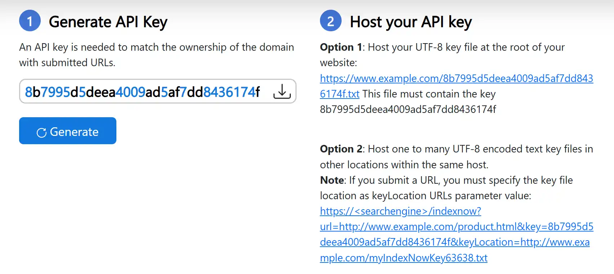
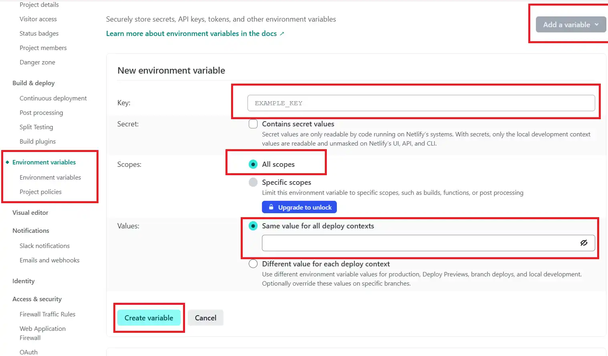
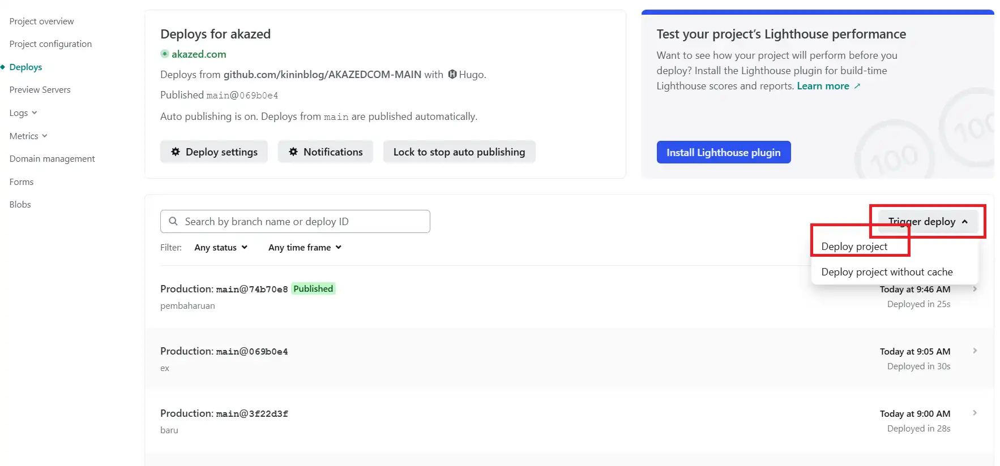
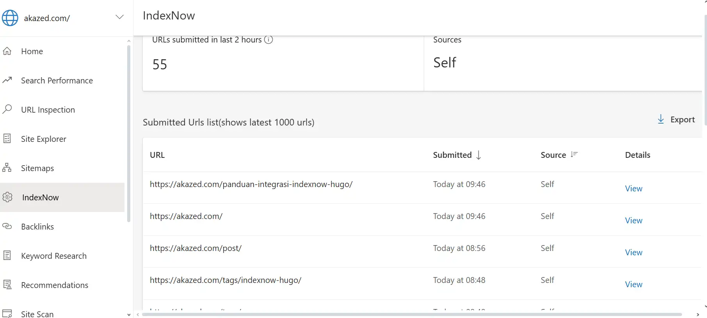

Wordpress dan CMS besar lainnya menggunakan Indexnow yang canggih untuk membantu mengindex situs mereka. Dan saya penasaran, bagaimana jika kita *[mengintegrasikan indexnow ke blog Hugo](/panduan-integrasi-indexnow-hugo/)* . Bisakah berhasil?

Beberapa waktu lalu saya tidak sengaja menemukan halaman diskusi di gohugo yang membahas topik ini, kamu bisa lihat *[di sini](https://discourse.gohugo.io/t/indexnow/48899)*. Mereka membahas, ***mungkinkah kita mengimplementasikan indexnow ke dalam sebuah blog hugo?***. Pertanyaan ini muncul karena mengingat *[Hugo merupakan](/welcome-to-my-hugo-blog/)* *Static Site Generator* (SSG) tidak menyediakan *Native support* seperti ini. Jadi kita harus mencari solusi lain.

>Kabar baiknya, ada solusi modern untuk masalah ini: Kita akan memanfaatkan proses build netlify dan memintanya untuk melakukan request ke indexnow dengan menggunakan API.

Dalam panduan lengkap ini, *[akazed](/)* akan membahas lebih dalam bagaimana penerapan dan cara integrasi IndexNow Hugo secara otomatis. Lupakan cara manual submit URL yang melelahkan. Setelah melakukan ini, setiap kali Anda mempublikasikan artikel baru, situs akan secara otomatis ***"memberi tahu"*** mesin pencari seperti Bing, dan Yandex. Hasilnya? **Indexing cepat** dan peningkatan Hugo SEO Anda.

## Apa Itu IndexNow dan Mengapa Penting untuk Hugo
*IndexNow adalah sebuah protokol sederhana yang memungkinkan sebuah situs web untuk memberi sinyal kepada mesin pencari bahwa ada konten yang baru dibuat, diperbaharui atau dihapus.* Alih-alih menunggu crawler datang, kita yang proaktif memberitahu mmereka.

### Manfaat Utamanya Sangat Signifikan
1. **Indexing Cepat:** Konten Anda berpotensi muncul di hasil pencarian dalam hitungan menit atau jam setelah dipublikasikan.
2. **Menghemat Crawl Budget:** Mesin pencari (*search engine)* tidak perlu lagi merayapi seluruh situs Anda untuk mencari perubahan.
3. **Peningkatan SEO Teknis:** Banyak tools SEO seperti All In One SEO Pack, Yoast SEO dan sebagainya sudah menyediakan fitur otomatis ini. Adalah pilihan bagus untuk menggunakannya.

## Bagaimana Cara Kerja IndexNow Hugo?
Prosesnya sangat sederhana namun efisien:
1. Anda mempublikasikan postingan baru
2. Netlify melakukan Build dan Deploy Situs
3. Setelah deploy berhasil, ia akan menjalankan skrip curl untuk mengirim ping ke *IndexNow*, memberitahukan bahwa situs Anda baru saja diperbaru

Berbeda dengan CMS Wordpress, kita tidak menggunakan plugin, melainkan hanya berupa script sederhana di setinggan netlify.

## Cara Integrasi IndexNow Hugo
Beberapa tahapan sederhana yang harus kita lakukan. Namun, pastikan situs website Anda sudah terdaftar di Bing webmaster ataupun Yandex. Pelajari lebih lengkap *cara mendaftarkan blog ke bing* atau *cara mendaftarkan blog ke yandex*.

1. **Dapatkan API Key IndexNow:** Generate dan unduh API key yang dibutuhkan dari situs resmi, kunjungi halaman berikut: *[https://www.bing.com/indexnow/getstarted](https://www.bing.com/indexnow/getstarted)*

2. **Simpan Kunci di folder *static***
3. **Ubah Setting Config netlify.toml**
```toml
[build]
  publish = "public"
  command = """
    # Warna output
    GREEN='\\033[0;32m'
    YELLOW='\\033[1;33m'
    RED='\\033[0;31m'
    CYAN='\\033[0;36m'
    NC='\\033[0m' # no color

    echo -e "${CYAN}🚀 Starting Hugo build...${NC}"
    if hugo; then
      echo -e "${GREEN}✅ Hugo build completed.${NC}"

      SITEMAP_PATH="public/sitemap.xml"
      TODAY=$(date -u +"%Y-%m-%d")

      if [ ! -f "$SITEMAP_PATH" ]; then
        echo -e "${RED}❌ sitemap.xml tidak ditemukan, skip IndexNow.${NC}"
        exit 0
      fi

      echo -e "${CYAN}📄 Parsing sitemap.xml (filter kategori/tag/post/homepage)...${NC}"
      URLS_SORTED=$(grep -E '<loc>|<lastmod>' "$SITEMAP_PATH" \
        | sed -e 's/<loc>//;s|</loc>||;s/<lastmod>//;s|</lastmod>||' \
        | paste - - | sort -rk2 \
        | grep -vE '/tags/|/categories/|/post/|/page/$|https://akazed.com/$')

      # Ambil URL yang diupdate hari ini
      URLS_TODAY=$(echo "$URLS_SORTED" | grep "$TODAY" | awk '{print $1}')

      if [ -n "$URLS_TODAY" ]; then
        echo -e "${GREEN}📅 Ditemukan $(echo "$URLS_TODAY" | wc -l) artikel baru hari ini.${NC}"
        URLS_TO_SEND="$URLS_TODAY"
      else
        echo -e "${YELLOW}ℹ️ Tidak ada artikel baru hari ini, skip pengiriman.${NC}"
        exit 0
      fi

      echo "$URLS_TO_SEND" > /tmp/latest_urls.txt
      echo -e "${CYAN}🔍 URLs to send:${NC}"
      cat /tmp/latest_urls.txt

      # Buat array JSON
      URL_JSON_ARRAY=$(printf '"%s",' $URLS_TO_SEND)
      URL_JSON_ARRAY=${URL_JSON_ARRAY%,}

      # Payload JSON
      JSON_PAYLOAD=$(cat <<EOF
{
  "host": "akazed.com",
  "key": "${INDEXNOW_KEY}",
  "keyLocation": "https://akazed.com/${INDEXNOW_KEY_FILENAME}",
  "urlList": [$URL_JSON_ARRAY]
}
EOF
)

      echo -e "${CYAN}📦 JSON payload yang akan dikirim:${NC}"
      echo "$JSON_PAYLOAD"

      echo -e "${CYAN}📤 Sending URL list to IndexNow...${NC}"
      RESPONSE=$(curl -s -o /tmp/indexnow_response.txt -w "%{http_code}" \
        -X POST https://api.indexnow.org/indexnow \
        -H 'Content-Type: application/json' \
        -d "$JSON_PAYLOAD")

      # Cek status
      if [ "$RESPONSE" -eq 202 ]; then
        echo -e "${GREEN}📡 IndexNow HTTP Status: $RESPONSE (Success)${NC}"
      elif [ "$RESPONSE" -eq 200 ]; then
        echo -e "${YELLOW}📡 IndexNow HTTP Status: $RESPONSE (Likely Success - body check below)${NC}"
      else
        echo -e "${RED}📡 IndexNow HTTP Status: $RESPONSE (Failed)${NC}"
      fi

      echo -e "${CYAN}📝 Response body:${NC}"
      cat /tmp/indexnow_response.txt

    else
      echo -e "${RED}❌ Hugo build failed, skipping IndexNow ping.${NC}"
    fi
  """

[context.production.environment]
  HUGO_VERSION = "0.123.1"
```

Sesuaikan alamat situs dan HUGO_VERSION yang anda gunakan.
4. **Tambahkan Pengaturan Environment API Key di Netlify**
`Key: INDEXNOW_KEY -> Value: (Isi dengan nilai kunci Anda)`
`Key: INDEXNOW_KEY_FILENAME -> Value: (Isi dengan nama file kunci Anda, misal: 2a59...c4a9.txt)`


5. **Deploy Ulang Situs:** Setelah itu trigger kembali tombol deploy untuk melakukan deploy ulang


## Apakah Cara Ini Berhasil
Debug console di netlify memang munjukkan **Response Status : 200** namun setelah saya lakukan cek di dashboard Bing search console URL Post berhasil dikirim ke Indexnow. Berarti Script ini sukses, namun kemungkinan ada beberapa kesalahan internal yang tidak saya ketahui yang menyebabkan Response 200. Seperti yang bisa kamu lihat di data berikut.


Setelah saya mempelajari *[dokumentasi IndexNow](https://www.indexnow.org/documentation)*, Response 200 berarti url sukses dikirim. Berikut daftar Respons yang mungkin muncul dan keterangannya

| HTTP Code | Response               | Reasons                                                               |
| :-------- | :--------------------- | :-------------------------------------------------------------------- |
| 200       | OK                     | URL submitted successfully                                            |
| 202       | Accepted               | URL received. IndexNow key validation pending.                        |
| 400       | Bad request            | Invalid format                                                        |
| 403       | Forbidden              | In case of key not valid (e.g. key not found, file found but key not in the file) |
| 422       | Unprocessable Entity   | In case of URLs which don’t belong to the host or the key is not matching the schema in the protocol |
| 429       | Too Many Requests      | Too Many Requests (potential Spam)                                    |

## Penutup
Selamat! Anda baru saja berhasil melakukan implementasi *[IndexNow Hugo](/panduan-integrasi-indexnow-hugo/)* secara penuh dan otomatis. Sekarang, Anda tidak perlu lagi khawatir tentang *[indexing cepat](https://www.farisyudza.com/13-cara-agar-website-terindex-dengan-cepat-di-google-internet-marketer-wajib-tahu/)*. Setiap karya yang Anda publikasikan akan segera "dilihat" oleh mesin pencari, memberikan keuntungan kompetitif dan memaksimalkan potensi SEO Hugo Anda.

Dengan sedikit pengaturan di awal, Anda telah membangun sebuah sistem submit URL otomatis yang efisien, menghemat crawl budget, dan memastikan konten Anda tidak pernah ketinggalan di belantara internet.

Punya pertanyaan atau menghadapi kendala? Jangan ragu untuk meninggalkan komentar di bawah!