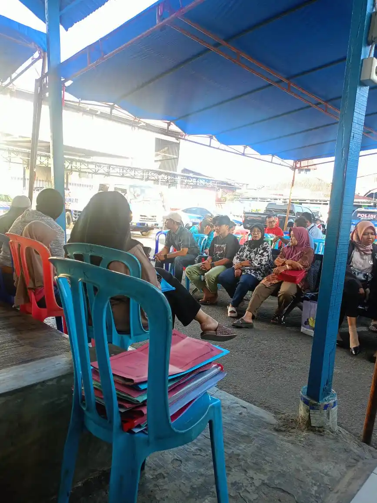

Pemerintahan Sumatera Barat lagi ngadain *event* pemutihan pajak kendaraan bermotor lagi nih. Gak mau ketinggalan, saya punya motor Supra X 125 yang udah mati pajak lebih dari 10 tahun, bayangin. Tapi, pas mau bayar pajak eh ternyata BPKB motor masih belum balik nama ke nama Saya. Yap, dulu tepatnya 2014 ayah membeli motor ini di dealer resmi, dengan kondisi *second*. 

Alhasil, saya harus mengganti atau balik nama bpk motor supra ini terlebih dahulu, 

>Dan kalian tau? Balik nama BPKB ternyata gak bisa lansung di daerah, dan harus ke pusat kota. Ya, hari ini saya sedang di padang mengurus pengalihan nama ini.

## Syarat Balik Nama Motor di Samsat Padang
Beberapa hal yang saya bawa sebagai amunisi ke sini antara lain
1. BPKB asli
2. STNK motor asli
3. KTP (foto copy)
4. Kwitansi jual beli

### Cerita Unik Syarat Balik Nama Motor yang Saya Bawa
1. **BPKB dan STNK asli**, untungnya saya masih menyimpan BPKB dan STNK kendaraan ini, walau udah agar robek, tapi ini adalah syarat utama. Jadi ga bisa kalau ga bawa
2. *KTP*, Yap kalian pasti punya yang namanya kartu tanda penduduk dong ya
3. Kwitansi Jual Beli, nah bagian ini saya udah ga punya lagi. Dan kata bagian informasi kwitansi ini sangat dibutuhkan, dan kebetulan tangan pertama motor saya sudah meninggal tahun 2014 silam. Dan ga bisa bikin lagi dong ya. Kalian tau apa solusi nya? *Yap, beli kwitansi dan meterai, bikin surat jual beli sendiri, tanda tangani sendiri.* Tentu ini terbilang ilegal, tapi ini juga yang disarankan bagian informasi samsat padang. Dan yah, pada praktiknya dilapangan saya yakin bukan hanya saya yang melakukan ini.

## Proses Balik Nama BPKB Motor
1. Masukin semua syarat yang dibawa tadi ke dalam satu map dan ambil nomor antrean
2. Setelah dipanggil, pergi ambil formulir permohonan kebagian informasi, dan lakukan cek motor.
3. Balik lagi ke bagian informasi, dan lengkapi semua datanya kembali
4. Baru datang keruangan BPKB untuk memasukkan permohonan, dan bayar uang biaya BPKB Rp. 225.000 untuk kendaraan roda dua, dan Rp. 300.000 untuk kendaraan roda empat. 
5. Setelah dilakukan validasi, kamu akan dikasih tanda kapan harus mengambil BPKB yang baru.

## Penutup dan Saran
Yap, ini hari pertama, dan di sini tertulis BPKB baru saya bisa diambil tanggal 25 juli mendatang. Mari kita tunggu saja.

Oh ya, bagi kalian warga sumatera barat jangan lupa ikut pemutihan pajak sumbar ini, karena kita gak tau lagi kapan kesempatan ini kembali datang. 

 

Saran saya, coba datang lebih pagi biar dapat nomor antrian pertama. saya sih datang pukul 7:40 wib, dan itupun udah banyak yang duduk antri. 

Selanjutnya, nanti bakal saya update lagi proses ngambilnya di samsat tanggal 25. stay tune.!