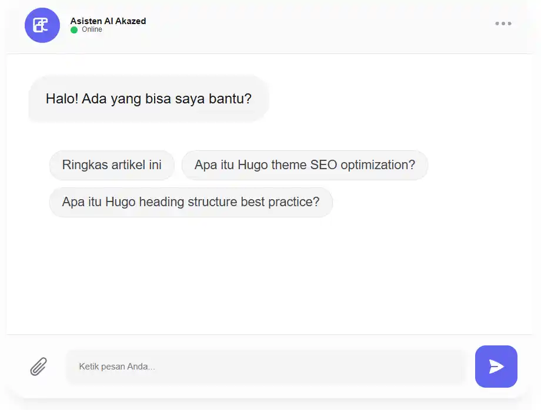

Melihat perkembangan AI yang makin masif semua orang bisa dengan mudah menemukan informasi yang mereka butuhkan dengan sangat cepat, dan itupun lansung *to the point*, dengan menggunakan *AI Chat bot* kita bisa menanyakan apapun tanpa perlu membaca artikel blog yang panjang nya bisa sampai seribu kata. 

Sebagai seorang blogger yang berusaha mendatangkan pengunjung untuk membaca artikel kita, *AI bisa menjadi ancaman serius*, namun ini adalah perkembangan teknologi yang tidak akan bisa dibendung, **solusinya**, ya tentu saja dengan berinovasi, dan memanfaatkannya dengan baik.

>Banyak situs sekarang mengintegrasikan *chat bot ai* di situs dan aplikasi mereka. memasang chat bot ai membuat Anda bisa menjawab pertanyaan pembaca 24 jam/7 hari non stop.

Selamat datang di dunia super cepat, di mana kecepatan informasi diutamakan. Sebagai seorang blogger, tugas kita adalah berinovasi. ***AI Chat Box*** bukan hanya sekadar *widget chat* biasa, ini adalah asisten virtual cerdas yang membuat blog Anda lebih interaktif dengan pengunjung, serta meningkatkan pengalaman pengguna. Dalam panduan lengkap ini, kita akan membahas tuntas ***cara memasang AI chat box di Blogger***, dengan menggunakan gemini ai, dan chat gpt, source kode gratis dan ga perlu ribet. Mari kita mulai!

## Pengenalan Chat AI Box untuk Blogger
### Apa Itu AI Chat Box? (Bukan Sekadar Live Chat Biasa)
Mungkin kamu sudah familiar dengan fitur *live chat blog*, di mana kamu harus online untuk membalas pesan. Nah, ***AI Chat box*** atau ***chatbot blogger*** adalah versi yang lebih canggih dari live chat blog tadi. 


Dengan memanfaatkan teknologi Artificial Intelegency (AI) yang super canggih, seperti Gemini AI ataupun Chat GPT membuat chatbot lebih powerfull. Sebagai seorang blogger, *memasang ai chat bot* di artikel meningkatkan pengalaman pengguna secara signifikan, yap salah satu fitur nya kita bisa membuat AI untuk membantu meringkas artikel yang sedang dibaca. Jadi pengguna ga perlu lagi membaca artikel panjangnya sampai seributa kata lebih.

### Mengapa Blogger Sekarang Butuh Chat Bot AI Gemini/Chat GPT?
Memasang chat bot ai bukan hanya sekadar mengikuti trend, ini adalah bentuk usaha kita untuk terus berinovasi dan mengikuti perkembangan teknologi agar blogger tidak semakin tergerus. Ada manfaat nyata lain yang bisa kita dapatkan dengan memasang AI di blogger.

1. **Meningkatkan Engagement Pengunjung**, sapaan hangat otomatis dapat meningkatkan interaksi dengan pembaca/pengunjung blog Anda, ini salah satu *Cara membuat blog lebih interaktif dengan AI* yang efisien.
2. **Membantu Pembaca Menemukan Informasi yang dicari**, dengan bantuan AI chat bot yang disediakan di halaman artikel dapat membantu pembaca menemukan informasi yang mereka butuhkan lebih cepat, sehingga diharapkan dapat meningkatkan *user experience*.
3. **Memberikan Kesan Profesional dan Modern**, memasang chat bot di blogspot gratis membuat blog terlihat lebih profesional dan modern di mata pengunjung.

### Contoh Tampilan Chat Box Blogger
Penasaran dengan tampilan chatbot gemini atau chat gpt di blogger? Ini preview nya

### Fitur Chat bot Artikel Blogger
Beberapa tutorial lain saya menemukan ada keterbatasan fitur AI yang sangat terasa, sehingga membuat widget chat ai di blogger nya menjadi terasa hambar dan *useless*, untuk itu mari kita tambahkan beberapa fitur seperti berikut:
1. **Fitur Ringkasan artikel**, kita buat AI dapat mendeteksi artikel yang sedang dibaca pembaca blog, dan membantu meringkasnya jika dibutuhkan.
2. **Fitur Terkait Topik**, Membantu user menemukan prompt pembahasan lebih dalam terkait topik yang dibahas, tapi mencari solusinya di blog kita, hmm... sepertinya ini menarik sekali jika kamu punya blog dengan artikel yang cukup banyak.

## Rekomendasi AI untuk Chat Bot Blogger
Rekomendasi *Plugin chatbot AI terbaik untuk Blogger* atau *Platform chatbot AI gratis untuk Blogger* yang akan kita gunakan adalah Google Gemini AI dan Chat GPT,

### Mengenal Gemini AI: Si Multitalenta dari Google
**Gemini AI**, yang sebelumnya dikenal sebagai *Google Bard*, adalah langkah ambisius Google untuk menciptakan AI yang lebih dari sekadar chatbot. Dibangun di atas arsitektur Large Language Model (LLM) yang canggih, Gemini dirancang sejak awal sebagai AI multimodal.

Artinya, Gemini tidak hanya memahami dan mengolah teks, tetapi juga mampu memproses dan memahami informasi dari berbagai format secara bersamaan, termasuk gambar, audio, dan bahkan video. Kemampuan inilah yang menjadi pembeda utama dan keunggulan signifikan Gemini.

#### Kelebihan Utama Gemini AI:

1. **Multimodal Sejati**: Mampu menganalisis dan merespons input yang beragam. Anda bisa menunjukkan gambar dan bertanya tentang isinya, atau bahkan meminta analisis dari sebuah video.
2. **Akses Informasi Real-time**: Terintegrasi langsung dengan Google Search, Gemini mampu memberikan jawaban yang didasarkan pada informasi terbaru dari internet.
3. **Integrasi Ekosistem Google**: Bekerja secara sinergis dengan layanan Google lainnya seperti Gmail, Google Drive, dan Google Maps, menjadikannya asisten yang sangat efisien untuk produktivitas.
4. **Kemampuan Penalaran Mendalam**: Dirancang untuk memahami konteks yang kompleks dan memberikan jawaban yang lebih akurat untuk tugas-tugas yang membutuhkan analisis data dan logika.

#### Kekurangan Gemini AI:

1. **Keterikatan pada Ekosistem Google**: Manfaat maksimalnya baru terasa jika Anda adalah pengguna setia layanan Google.
2. **Jawaban yang Terkadang Terlalu Hati-hati**: Dalam beberapa kasus, respons yang diberikan bisa terasa lebih kaku atau terlalu berhati-hati dibandingkan kompetitornya.

### Membedah ChatGPT: Sang Pelopor Percakapan Kreatif
ChatGPT adalah model AI yang dikembangkan oleh OpenAI dan sukses mencuri perhatian dunia sejak pertama kali diluncurkan. Berbasis arsitektur Generative Pre-trained Transformer (GPT), ChatGPT unggul dalam menghasilkan teks yang sangat natural, kreatif, dan mengalir layaknya percakapan dengan manusia sungguhan.

Fokus utama ChatGPT adalah pada interaksi dan pembuatan konten berbasis teks. Kemampuannya dalam menulis esai, puisi, skenario, hingga kode pemrograman dalam berbagai gaya menjadikannya favorit di kalangan penulis, pemasar, dan pengembang.

#### Kelebihan Utama ChatGPT:
1. **Kreativitas Tanpa Batas**: Sangat andal dalam menghasilkan berbagai jenis konten kreatif dengan gaya bahasa yang bisa disesuaikan.
2. **Alur Percakapan Natural**: Mampu mengingat konteks percakapan sebelumnya, sehingga interaksi terasa lebih lancar dan relevan.
3. **Fleksibilitas Tinggi**: Mudah diadaptasi untuk berbagai tugas penulisan, mulai dari brainstorming ide hingga membuat draf lengkap.
4. **Basis Pengguna yang Luas**: Popularitasnya yang masif membuat banyak sekali sumber daya dan komunitas online untuk belajar dan berbagi tips.

#### Kekurangan ChatGPT:
1. **Keterbatasan Informasi Real-time (versi gratis)**: Pengetahuan model dasarnya terbatas pada data hingga tahun tertentu, sehingga kurang akurat untuk menjawab pertanyaan tentang peristiwa terkini.
2. **Akurasi Faktual**: Terkadang bisa menghasilkan informasi yang terdengar meyakinkan namun sebenarnya tidak akurat (halusinasi AI).
3. **Kurang Mendalam dalam Analisis Data**: Tidak dirancang secara spesifik untuk analisis data kompleks seperti Gemini.

### Mana yang Kita Pilih untuk Membuat Chat bot blogspot gratis?
>Tergantung sih!, kamu punya API key yang mana? pengguna gratisan dan ingin informasi lebih aktual Gemini bisa jadi piliham. Untuk enterprise, kayaknya Chat GPT lebih fleksibel.

## Memasang Chat Bot di Blogger
Kita lanjut ke *Tutorial integrasi chatbot AI di Blogger*, memang proses *Memasang widget chat di Blogger tanpa coding* bukan benar-benar 100% tanpa coding, tapi kamu hanya perlu copy-paste saja kok.

Untuk Menambahkan layanan pelanggan otomatis di Blogspot alias bot ai ini, ikuti beberapa *step* berikut.

### 1. 