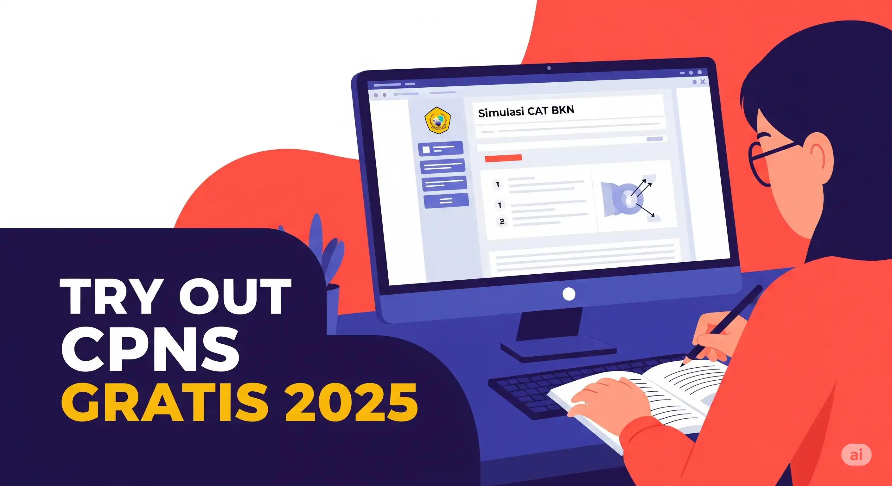

Bagi Anda yang sudah menantikan pembukaan CPNS 2025, ada kabar baik sekaligus tantangan baru. Pendaftaran CPNS memang akan dibuka antara Agustus hingga September mendatang. Namun, jika Anda berpikir seleksi CPNS 2025 akan berjalan seperti tahun-tahun sebelumnya, siap-siap terkejut. 

Pemerintah melalui Badan Kepegawaian Negara (BKN) telah secara resmi memperkenalkan *[sistem seleksi CPNS 2025](/bagaimana-sistem-seleksi-cpns/)* terbaru yang benar-benar revolusioner. Ini bukan lagi sekadar mengunggah dokumen, mengikuti tes, dan menunggu hasil. Mulai dari cara daftar, mekanisme tes, hingga peluang kelulusan, semuanya dirombak total. Teknologi digital kini menjadi tulang punggung utama, dan strategi yang matang menjadi kunci utama keberhasilan Anda.

Kepala BKN, **Prof. Zudan Arif Fakrulloh**, mengungkapkan bahwa sistem seleksi sebelumnya, yang diikuti 6,6 juta peserta dan menelan biaya hingga Rp1,1 triliun, dianggap kaku dan mahal. Oleh karena itu, BKN menyiapkan skema baru untuk seleksi Calon Pegawai Negeri Sipil (CPNS) yang lebih efisien, hemat biaya, dan fleksibel bagi peserta. Lantas, apa saja perubahan besar CPNS 2025 yang wajib Anda tahu agar tidak gagal sejak awal pendaftaran dan bagaimana cara baru lolos jadi ASN? Mari kita telaah satu per satu.

## 7 Perubahan Kunci dalam Sistem Seleksi CPNS 2025 yang Wajib Anda Pahami

Sistem rekrutmen Aparatur Sipil Negara (ASN) tahun anggaran 2025/2026 ini membawa* perubahan CPNS yang signifikan*. Prof. Zudan Arif Fakrulloh menjelaskan bahwa perubahan ini bertujuan untuk menciptakan seleksi yang lebih adil dan proporsional. Berikut adalah poin-poin pentingnya:

1. ***Ujian CPNS Tidak Lagi Digelar Serempak Nasional*** Lupakan jadwal ujian serentak nasional yang seringkali menimbulkan stres bagi jutaan peserta. Salah satu perubahan besar CPNS 2025 adalah jadwal ujian kini bisa berbeda-beda antar daerah atau instansi. Sistem ini dirancang untuk lebih fleksibel dan efisien, serta untuk menghemat anggaran. Ini berarti Anda harus lebih proaktif dalam memantau jadwal masing-masing instansi yang Anda incar agar tidak ketinggalan informasi.
2. ***AI dan Big Data Ambil Alih Proses Seleksi***, Menjamin Transparansi Sistem seleksi CPNS 2025 terbaru akan sangat mengandalkan teknologi canggih seperti Artificial Intelligence (AI) dan Big Data. Mulai dari proses verifikasi data pelamar hingga analisis hasil ujian, semuanya akan diawasi secara ketat oleh teknologi. Ini berarti tidak akan ada lagi celah untuk "orang dalam" atau praktik manipulasi. Semua data diolah secara real-time, transparan, dan terintegrasi, menjadikan proses seleksi lebih objektif dan bebas manipulasi. Ini adalah langkah besar menuju proses rekrutmen ASN yang benar-benar bersih dan adil.
3. ***Gagal di Satu Subtes? Cukup Ulang Bagian Itu Saja!*** Ini adalah salah satu perubahan CPNS 2025 yang paling disambut baik oleh calon peserta. Sebelumnya, jika Anda gagal di satu bagian tes, Anda harus mengulang seluruh rangkaian Tes CPNS. Kini, tes CPNS 2025 akan lebih menyerupai sistem ujian seperti TOEFL, di mana jika Anda gagal di bagian tertentu (misalnya, Tes Karakteristik Pribadi/TKP), Anda hanya perlu mengulang subtes tersebut tanpa harus mengulang *[Tes Intelegensi Umum](/categories/tryout-tiu/)* (TIU) atau *[Tes Wawasan Kebangsaan](/categories/tryout-twk/)* (TWK). Kepala BKN menegaskan bahwa peserta hanya perlu memperbaiki nilai di subtes yang belum memenuhi passing grade. Ini sangat menghemat waktu, tenaga, dan biaya bagi peserta.
4. ***Hasil Tes Berlaku Hingga Dua Tahun Sejalan dengan poin sebelumnya***, hasil tes CPNS Anda kini memiliki masa berlaku yang lebih panjang, yaitu hingga dua tahun. Jika Anda tidak lolos pada seleksi pertama, hasil tes yang telah Anda peroleh masih bisa digunakan untuk seleksi tahun berikutnya tanpa perlu mengikuti keseluruhan tes lagi. Fitur ini juga mirip dengan sistem ujian TOEFL atau IELTS, memberikan fleksibilitas dan mengurangi beban peserta.
5. ***Peserta Bisa Memilih Waktu Tes Sesuai Kesiapan Masing-Masing*** Kembali ke poin mengenai ujian yang tidak lagi serentak, Prof. Zudan Arif Fakrulloh juga menjelaskan bahwa peserta nantinya bisa melakukan *[tes CPNS](/ujian/)* sesuai dengan kesiapan masing-masing. Hal ini memberikan kontrol lebih besar kepada peserta untuk menentukan momen terbaik mereka dalam menghadapi ujian. Dengan jadwal yang lebih fleksibel, Anda bisa merencanakan strategi menghadapi CPNS 2025 dengan lebih baik, termasuk mempersiapkan diri melalui try out simulasi ujian berbasis *[Ujian CAT](/ujian/cpns/tryout-cat-cpns-gratis/)* yang kini bisa disesuaikan dengan waktu Anda.
6. ***Pembatasan Pemilihan Formasi***: Hanya Dua Pilihan Salah satu fakta mengejutkan dari seleksi CPNS 2025 adalah pembatasan jumlah formasi yang bisa Anda lamar. Peserta hanya diperbolehkan melamar maksimal dua formasi. Ini membuat strategi pemilihan formasi CPNS menjadi sangat krusial. Anda tidak bisa lagi sembarangan memilih. Penting untuk mempelajari detail syarat, lokasi penempatan, dan peluang kelulusan dari setiap formasi yang Anda minati. Kabar lain menyebutkan bahwa penempatan bisa di daerah, menambah pertimbangan dalam memilih formasi.
7. ***Kuota CPNS Dipangkas Meskipun sistem seleksi menjadi lebih efisien dan fleksibel***, ada indikasi bahwa kuota CPNS dipangkas atau dibatasi. Berdasarkan data Kepala BKN, dari 6,6 juta peserta di tahun sebelumnya, hanya sekitar 1 juta ASN yang berhasil direkrut. Hal ini menandakan bahwa persaingan untuk menjadi PNS akan tetap ketat. Oleh karena itu, persiapan yang matang dan pemahaman mendalam tentang perubahan sistem seleksi CPNS 2025 sangat diperlukan.

## Implikasi dan Persiapan Menghadapi CPNS 2025
Dengan berbagai perubahan besar CPNS 2025 yang diumumkan oleh BKN ini, penting bagi Anda untuk menyesuaikan strategi persiapan. Berikut adalah beberapa poin penting dan tips untuk cara lolos CPNS 2025:

* ***Pantau Informasi Resmi BKN dan SSCASN***: Pastikan Anda selalu mendapatkan informasi terbaru dari kanal resmi BKN. Pendaftaran CPNS 2025 akan melalui portal SSCASN, jadi penting untuk memahami tahapan awal CPNS 2025 yang harus kamu tahu, termasuk panduan daftar akun dan dokumen wajib untuk lolos seleksi.
* ***Fokus pada Persiapan Subtes***: Karena Anda bisa mengulang hanya subtes yang gagal, fokuskan persiapan Anda pada penguasaan semua bagian SKD (TIU, TWK, TKP). Lakukan *[try out CPNS](/categories/tryout-cpns/)* secara berkala untuk mengidentifikasi area kelemahan Anda. Platform simulasi ujian berbasis Ujian CAT akan sangat membantu Anda beradaptasi dengan sistem ini.
* ***Strategi Pemilihan Formasi***: Dengan hanya dua pilihan formasi, lakukan riset mendalam. Pertimbangkan kualifikasi Anda, kebutuhan instansi, dan peluang penempatan. Jangan tergiur hanya pada jabatan favorit, tetapi sesuaikan dengan kemampuan dan minat Anda.
* ***Manfaatkan Hasil Tes 2 Tahun***: Jika Anda sudah memiliki hasil Seleksi Kompetensi Dasar (SKD) yang baik dari tahun sebelumnya (sesuai ketentuan validitas 2 tahun), Anda bisa lebih fokus pada seleksi berikutnya atau mencoba formasi lain. Ini adalah keuntungan besar yang harus dimanfaatkan.
* ***Persiapan Mental dan Teknis***: Sistem yang lebih digital dan fleksibel menuntut adaptasi. Pastikan Anda terbiasa dengan lingkungan tes berbasis komputer dan memahami mekanisme real-time yang diawasi AI.

>Penting juga untuk tidak panik jika muncul berita seperti *"CPNS 2025 Ditiadakan"*. Sumber-sumber yang saya miliki menunjukkan bahwa seleksi CPNS tetap diadakan, namun dengan sistem yang dirombak total. Bahkan, bagi yang mungkin tidak lolos CPNS, peluang menjadi ASN masih ada melalui jalur PPPK (Pegawai Pemerintah dengan Perjanjian Kerja), yang juga akan membuka rekrutmen di instansi strategis.

## Kesimpulan
**Seleksi CPNS 2025** menandai era baru dalam rekrutmen ASN di Indonesia. Dengan 7 perubahan besar yang diusung BKN, termasuk tes CPNS tidak lagi serentak, pemanfaatan AI dan Big Data, serta fleksibilitas dalam mengulang subtes dan masa berlaku hasil tes yang lebih panjang, proses ini diharapkan menjadi lebih adil, transparan, dan efisien.

Meskipun kuota mungkin dipangkas dan pilihan formasi dibatasi, peluang untuk menjadi PNS atau PPPK tetap terbuka lebar bagi mereka yang mempersiapkan diri dengan baik dan beradaptasi dengan sistem baru CPNS 2025. Jangan hanya mengandalkan keberuntungan; pahami setiap detail perubahan sistem CPNS 2025, manfaatkan try out untuk mengasah kemampuan Anda, dan siapkan strategi terbaik untuk lolos menjadi bagian dari Aparatur Sipil Negara. Tetap pantau informasi terbaru dari BKN dan bersiaplah untuk pendaftaran di bulan Agustus-September