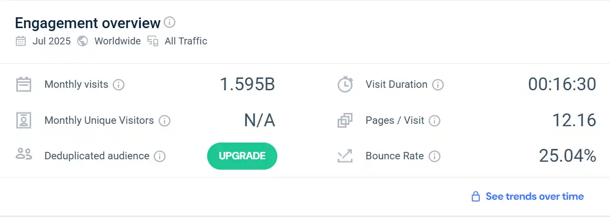
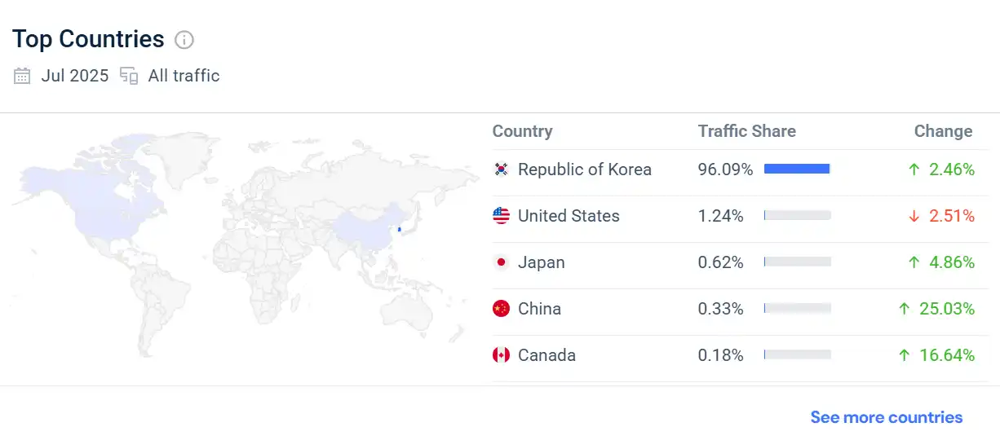
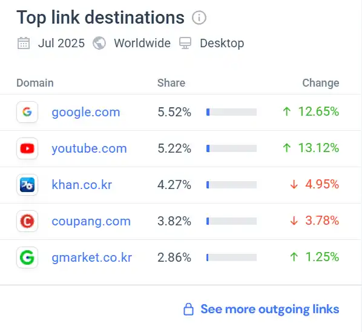
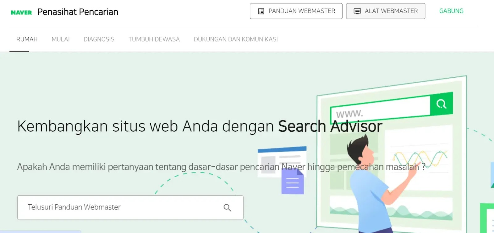
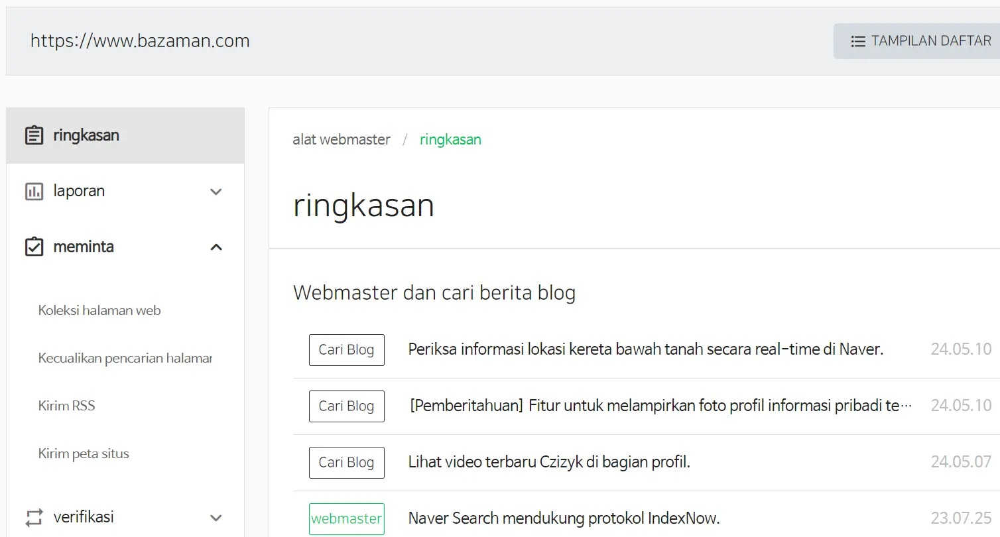

Bukan **Google** tapi di Korea **Naver** menjadi mesin pencari atau *search engine* paling populer dan paling banyak digunakan. Bagi seorang *[blogger](/categories/blogger/)*, ini menjadi salah satu peluang tambahan untuk meningkatkan tampilan situs terutama jika *niche blog* kamu seputar Korea atau memiliki *target audience* Korea selatan. Dengan beberapa tahapan mudah, kamu sudah bisa *[mendaftarkan blog ke naver search console](/submit-blog-ke-naver-webmaster/)*. 

Di artikel kali ini *[akazed](/)* akan memandu kamu untuk melalui setiap *langkah-langkah verifikasi situs di Naver*, mulai dari persiapan awal hingga strategi optimasi tingkat lanjut. Kami akan menjawab pertanyaan krusial seperti, *"Kenapa blog saya tidak muncul di Naver?"* dan tips untuk melakukan *optimasi SEO* untuk mesin pencari Naver secara efektif.

## Apa Itu Naver?

Pengguna Webtoon mungkin sudah tidak asing lagi dengan Naver, karena memang webtoon komik merupakan salah satu layanan dari perusahaan Naver. **Naver (Hangul : 네이버) adalah** portal web populer di Korea selatan milik perusahaan [Naver Corporation](https://www.navercorp.com/) yang diluncurkan pada tahun 1999.

Pada tahun 2000-an Naver menambahkan vitur _Comprehensive Search_ yang memungkinkan untuk digunakan seperti mesin pencari. Sampai sekarang, fitur ini semakin populer digunakan terutama pengguna lokal Negara Korea.

### Traffic Search Engine Naver Korea
Berdasarkan data yang diambil dari simmilarweb, jumlah pengunjung Naver setiap bulan selalu stabil, dan cukup besar, diangka 1 Miliar kunjungan perbulan. 

1 Miliar kunjungan perbulan sudah bisa dianggap sangat besar, karena mengingat mesin pencari ini merupakan pencari lokal, terutama dengan target Korea selatan.

### Negara yang Menggunakan Naver
Selain Korea, beberapa negara lain yang menggunakan Naver webtoon seperti.
1. Korean Selatan
2. United States
3. Jepang
4. China
5. canada
Lengkapnya kamu bisa lihat statistik pengguna berikut

### Situs Populer Dicari di Naver
Uniknya, Top link destinasi dari naver malah ke google, dan youtube. 

## Mendaftarkan Blog ke Search Engine Naver

Sama seperti Google, agar situs web atau blog Anda muncul dan terindex di Naver, Anda perlu mendaftarkannya ke webmaster terlebih dahulu. atau di Naver dikenal sebagai _Search Advisor_. Lebih jelasnya ikuti panduan mendaftarkan dan submit web di naver berikut

>Saya merekomendasikan browser chrome, karena Anda membutuhkan fitur translate untuk menerjemahkan bahasa Korea.

1. Buka [Search Advisor](https://searchadvisor.naver.com/)
2. Pilih **Alat Master**
3. Lalu Sign In via Facebook atau Line biar lebih mudah
4. Masukkan url website atau blog Anda dan klik selanjutnya
5. Lalu verifikasi kepemilikan dengan menggunakan tag HTML seperti biasa
6. Selamat blog anda sudah terdaftar di Naver

Setelah Anda berhasil mendaftarkan dan memverifikasi kepemilikan blog, agar blog cepat terindeks Anda bisa menambahkan sitemap.xml, dan url rss.

### Menambahkan Sitemap dan RSS di Naver Search Advisor

1. Buka kembali dashboard Search Advisor Anda

2. Pilih menu **Meminta > Kirim RSS** _(untuk mengirim RSS)_ **\> Kirim Peta Situs** _(untuk mengirim sitemap)_
3. Tunggu proses perayapan robot Naver

Pastikan robot.txt dan sitemap kamu valid, untuk meningkatkan kecepatan index blog tambahkan juga *[meta tags seo](/meta-tag-seo-blogger-terbaru/)* blogger terbaru.
## Mudah Bukan Mendaftarkan Blog ke Naver?

Itu dia *[tutorial](/categories/tutorial/)* kali ini, sangat mudah sekali untuk mendaftarkan blog ke search engine naver.

Tips tambahan, jangan lupa gunakan plug in indexnow biar blog kamu lebih cepat terindex. Kalau kamu pengguna hugo, ataupun jekyll kamu bisa baca panduan berikut *[indexnow hugo](/panduan-integrasi-indexnow-hugo/)*. 