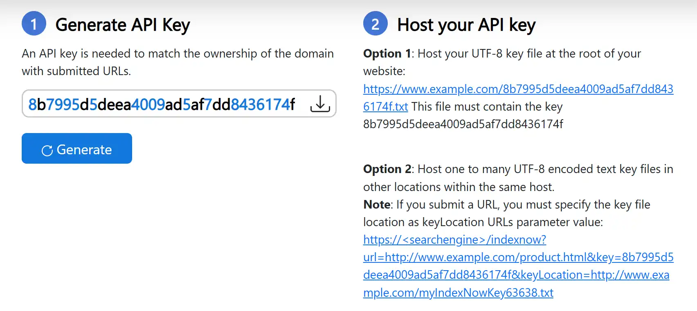
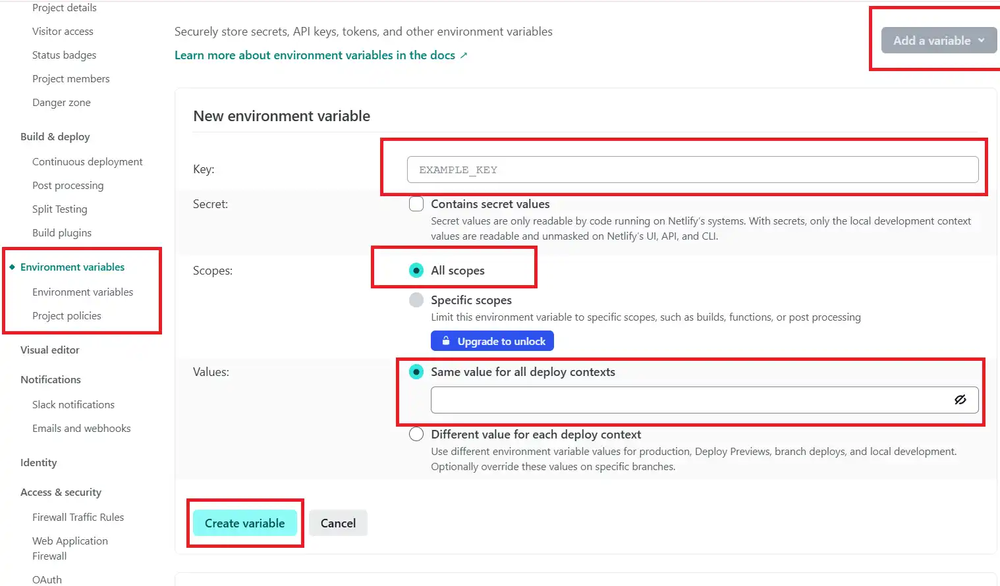
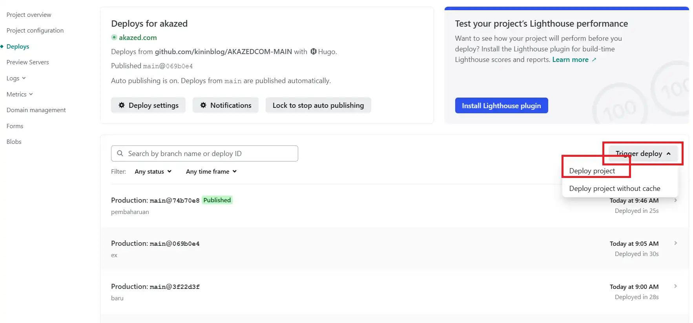
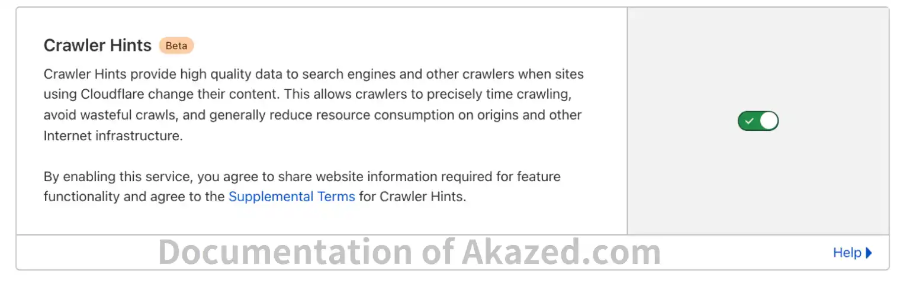

*Indexing* merupakan suatu proses yang sangat penting agar konten website kamu bisa ditemukan oleh pengguna melalui mesin pencari. Salah satu Inovasi terbaru dalam hal ini adalah diterbitkannya *IndexNow* pada Bing Search Console.

Minggu lalu *[akazed](/)* sudah membahas tentang bagaimana cara *[implementasi indexnow di hugo](/panduan-integrasi-indexnow-hugo/)*, dan kali ini kita akan memasang *[plugin IndexNow di Jekyll](/indexnow-jekyll-plugin/)*. Apakah bisa?

## Apa Itu Plugin IndexNow pada Bing Search Console
*IndexNow* adalah fitur yang disediakan oleh Bing *search console* yang sangat membantu para *[blogger](/categories/blogger/)*, tool ini merupakan salah satu layanan Bing Webmaster Tool yang membantu pemilik website untuk memberitahu Bing dan beberapa search engine lainnya jika ada perubahan konten terbaru secara instan dan otomatis.

Alat ini merupakan terobosan besar dalam dunia *[SEO](/categories/seo/)*, pengguna tidak perlu lagi melakukan ping secara manual agar mesin pencari seperti Bing melakukan *"crawling"* data.

Cara kerjanya adalah dengan mengirim URL melalui indexnow API secara otomatis. 

Bukan hanya Bing, beberapa mesin pencari besar yang berpartisipasi dalam proyek IndeNow ada Yandex, *[Naver](/submit-blog-ke-naver-webmaster/)* dan kemungkinan Google akan ikut serta di masa depan.


### Manfaat Menggunakan IndexNow di Jekyll

Berikut adalah manfaat utama yang akan Anda dapatkan:

#### 1. **Indeksasi Konten Hampir Seketika**
- **Kecepatan Maksimal:** Manfaat terbesar adalah kecepatan. Alih-alih menunggu mesin pencari menemukan perubahan Anda, Anda secara proaktif memberi tahu mereka. Ini memotong waktu tunggu dari hari atau minggu menjadi hanya beberapa menit atau jam.
- **Sangat Penting untuk Konten Mendesak:** Ideal untuk situs berita, blog dengan postingan terkini, situs e-commerce dengan pembaruan stok, atau pengumuman pekerjaan.

#### 2. **Peningkatan Performa SEO**
- **Visibilitas Lebih Cepat:** Konten Anda muncul di hasil pencarian (SERP) lebih cepat, memberikan Anda keunggulan kompetitif.
- **Lalu Lintas Lebih Cepat:** Semakin cepat halaman Anda diindeks, semakin cepat halaman tersebut dapat menarik lalu lintas organik.

#### 3. **Efisiensi Beban Server**
- **Mengurangi *Crawl* yang Tidak Perlu:** Mesin pencari tidak perlu lagi terus-menerus mengunjungi situs Anda untuk memeriksa pembaruan. Mereka hanya akan datang ketika diberi tahu, sehingga mengurangi beban pada server Anda.
- **Menghemat *Bandwidth*:** Lebih sedikit *crawl* dari *bot* berarti lebih sedikit penggunaan *bandwidth*, yang bisa menjadi keuntungan bagi situs dengan lalu lintas tinggi.

#### 4. **Penyebaran Informasi yang Luas**
- **Satu untuk Semua:** Saat Anda mengirimkan URL ke salah satu mesin pencari yang berpartisipasi (seperti Bing atau Yandex), URL tersebut akan secara otomatis dibagikan ke semua mesin pencari lain yang mendukung protokol ini. Anda tidak perlu memberi tahu setiap mesin pencari satu per satu.

#### 5. **Implementasi Mudah dan Gratis**
- **Banyak Dukungan:** Sebagian besar platform populer seperti WordPress (melalui plugin seperti Rank Math atau All in One SEO), Cloudflare, dan banyak CMS lainnya sudah mendukung IndexNow secara bawaan atau melalui ekstensi.
- **Protokol Terbuka:** IndexNow adalah standar terbuka dan gratis untuk digunakan. Tidak ada biaya tersembunyi.


| Manfaat | Deskripsi Singkat |
| :--- | :--- |
| 🚀 **Indeksasi Cepat** | Konten terindeks dalam hitungan menit/jam, bukan hari/minggu. |
| 📈 **Peningkatan SEO** | Visibilitas lebih cepat di hasil pencarian (SERP). |
| ⚙️ **Efisiensi Server** | Mengurangi beban *crawl* dari *bot* mesin pencari. |
| 🌐 **Distribusi Luas** | Satu "ping" akan memberitahu semua mesin pencari yang berpartisipasi. |
| ✅ **Implementasi Mudah** | Banyak didukung oleh platform CMS dan layanan web populer. |

## Cara Menggunakan IndexNow di Jekyll
Sama seperti *[blog hugo](/welcome-to-my-hugo-blog/)*, Jekyll merupakan Static Site Generator yang populer digunakan, dibuat dalam bahasa Ruby yang didukung lansung oleh GitHub Pages.

Plugin IndexNow Jekyll menggunakan script API sederhana, yang cara integrasinya pun sangat mudah. 

Perlu dicatat, di sini saya menggunakan Netlify sebagai hosting, kamu bisa menyesuaikan script yang ada.


1. **Dapatkan API Key IndexNow:** Generate dan unduh API key yang dibutuhkan dari situs resmi, kunjungi halaman berikut: *[https://www.bing.com/indexnow/getstarted](https://www.bing.com/indexnow/getstarted)*

2. **Simpan Kunci di folder *static***
3. **Ubah Setting Config netlify.toml**
```toml
# netlify.toml (Versi untuk Jekyll)

[build]
  # Folder output default Jekyll adalah _site
  publish = "_site" 
  command = """
    # --- Konfigurasi Awal ---
    GREEN='\\033[0;32m'
    YELLOW='\\033[1;33m'
    RED='\\033[0;31m'
    CYAN='\\033[0;36m'
    NC='\\033[0m' # No Color

    # !! PENTING: Ganti dengan domain Anda !!
    HOST="your-jekyll-site.com" 
    # Path sitemap di dalam folder output Jekyll
    SITEMAP_PATH="_site/sitemap.xml"
    
    # --- Proses Build Jekyll ---
    echo -e "${CYAN}🚀 Memulai proses build Jekyll...${NC}"
    # Gunakan 'bundle exec' untuk memastikan versi yang benar
    if ! bundle exec jekyll build; then
      echo -e "${RED}❌ Build Jekyll gagal. Proses IndexNow dibatalkan.${NC}"
      exit 1
    fi
    echo -e "${GREEN}✅ Build Jekyll berhasil.${NC}"

    # --- Validasi Sitemap ---
    if [ ! -f "$SITEMAP_PATH" ]; then
      echo -e "${RED}❌ File sitemap.xml tidak ditemukan di '$SITEMAP_PATH'. Proses IndexNow dilewati.${NC}"
      exit 0
    fi

    # --- Parsing URL dari Sitemap ---
    echo -e "${CYAN}📄 Mem-parsing sitemap.xml untuk URL terbaru...${NC}"
    TODAY=$(date -u +"%Y-%m-%d")

    # Mengambil semua URL yang dimodifikasi hari ini.
    # Filter ini (tags/categories) mungkin perlu disesuaikan dengan struktur URL Jekyll Anda.
    URLS_TODAY=$(grep -E '<loc>|<lastmod>' "$SITEMAP_PATH" \\
      | sed -e 's/<loc>//;s|</loc>||;s/<lastmod>//;s|</lastmod>||' \\
      | paste -d' ' - - \\
      | grep "$TODAY" \\
      | grep -vE '/tags/|/categories/' \\
      | awk '{print $1}')

    if [ -z "$URLS_TODAY" ]; then
      echo -e "${YELLOW}ℹ️ Tidak ada URL baru atau yang diperbarui hari ini. Pengiriman ke IndexNow dilewati.${NC}"
      exit 0
    fi

    URL_COUNT=$(echo "$URLS_TODAY" | wc -l | xargs)
    echo -e "${GREEN}📅 Ditemukan ${URL_COUNT} URL untuk dikirim ke IndexNow.${NC}"
    echo "$URLS_TODAY"

    # --- Persiapan dan Pengiriman ke IndexNow ---
    URL_JSON_ARRAY=$(printf '"%s",' $URLS_TODAY | sed 's/,$//')

    JSON_PAYLOAD=$(cat <<EOF
{
  "host": "${HOST}",
  "key": "${INDEXNOW_KEY}",
  "keyLocation": "https://${HOST}/${INDEXNOW_KEY_FILENAME}",
  "urlList": [${URL_JSON_ARRAY}]
}
EOF
)

    echo -e "${CYAN}📦 Payload JSON yang akan dikirim:${NC}"
    echo "$JSON_PAYLOAD"

    echo -e "${CYAN}📤 Mengirim daftar URL ke API IndexNow...${NC}"
    RESPONSE_CODE=$(curl --silent --output /dev/null --write-out "%{http_code}" \\
      --request POST "https://api.indexnow.org/indexnow" \\
      --header "Content-Type: application/json" \\
      --data "${JSON_PAYLOAD}")

    # --- Analisis Respons ---
    echo -e "${CYAN}📡 Menerima respons dari IndexNow...${NC}"
    if [ "$RESPONSE_CODE" -ge 200 ] && [ "$RESPONSE_CODE" -lt 300 ]; then
      echo -e "${GREEN}✅ Berhasil! IndexNow merespons dengan status HTTP: ${RESPONSE_CODE}${NC}"
    else
      echo -e "${RED}❌ Gagal! IndexNow merespons dengan status HTTP: ${RESPONSE_CODE}${NC}"
      echo -e "${RED}   Pastikan variabel INDEXNOW_KEY dan INDEXNOW_KEY_FILENAME sudah benar di pengaturan Netlify.${NC}"
    fi
  """

# Anda mungkin perlu menentukan versi Ruby jika Netlify tidak mendeteksinya secara otomatis
# [build.environment]
#   RUBY_VERSION = "3.0.2"
```


Sesuaikan alamat situs dan HUGO_VERSION yang anda gunakan.
4. **Tambahkan Pengaturan Environment API Key di Netlify**
`Key: INDEXNOW_KEY -> Value: (Isi dengan nilai kunci Anda)`
`Key: INDEXNOW_KEY_FILENAME -> Value: (Isi dengan nama file kunci Anda, misal: 2a59...c4a9.txt)`


5. **Deploy Ulang Situs:** Setelah itu trigger kembali tombol deploy untuk melakukan deploy ulang


Lihat dokumentasi github ***[Indexnow Jekyll Github](https://github.com/kininblog/indexnow-jekyll)***

## Integrasi IndexNow Menggunakan CloudFlare Hints
Crawler Hints adalah layanan yang dikembangkan oleh Cloudflare, yang sebagian mendukung dan terintegrasi dengan pengiriman URL protokol IndexNow. Layanan ini gratis digunakan oleh semua pengguna Cloudflare dan menjanjikan revolusi efisiensi web. 

Pengguna juga bisa menggunakan cara ini sebagai alternatif terbaik untuk mengintegrasikan IndexNow dengan blog dengan cara yang sangat simpel dan mudah. Berikut caranya:

1. Masuk ke Akun Cloudflare Anda.
2. Di dasbor, buka tab Cache.
3. Klik bagian Konfigurasi.
4. Pada bagian Crawler Hints dan aktifkan.


Setelah mengaktifkannya, Cloudflare akan mulai mengirimkan Ping ke mesin pencari kapan mereka harus merayapi bagian tertentu situs web.

## Penutup
Seharusnya cara ini berhasil, kamu hanya perlu menyesuaikan beberapa data dan pengaturan pada script di atas. 

Jadi, itu dia tips dan *[tutorial](/categories/tutorial/)* menggunakan indexnow di jekyll beserta contoh scriptnya, silahkan berikan tanggapan jika terjadi error yang tidak terduga.