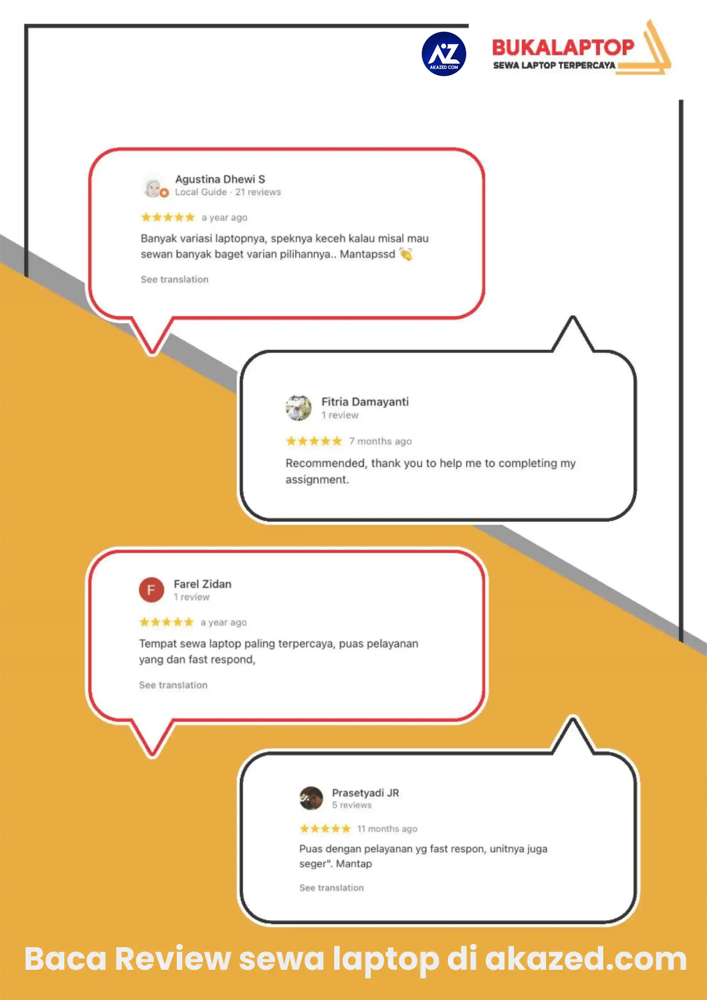

**SEMARANG** - *[Sewa Laptop Semarang](https://bukalaptop.com/sewa-laptop-semarang)* semakin dicari banyak orang saat ini. Di era saat ini, *[laptop](/categories/tech/)* telah menjelma menjadi kebutuhan penting, terutama bagi pelajar hingga pegawai kantoran. Tidak semua orang memiliki budget yang cukup untuk membeli laptop sehingga menyewa laptop menjadi sebuah solusi tepat untuk mengatasinya.

Salah satu rekomendasi *[jasa sewa laptop di Semarang](/sewa-laptop-semarang-terbaik/)* yang bisa dipertimbangkan adalah BukaLaptop. Sudah banyak testimoni pelanggan sebelumnya di Google yang memberikan rating bintang 5. Mereka puas dengan layanan yang diberikan, baik itu dari penyediaan laptop maupun keramahan tim *BukaLaptop*.

Jasa sewa laptop di Semarang satu ini menawarkan berbagai kemudahan dan keuntungan dalam mendukung kegiatan digital Anda. Apa saja kelebihannya? Simak ulasannya berikut ini!

## Kelebihan Sewa Laptop Semarang di BukaLaptop
BukaLaptop tidak hanya menyediakan perangkat keras berkualitas, tetapi juga memberikan fleksibilitas luar biasa untuk memenuhi berbagai kebutuhan digital para pelanggan.

Adapun beberapa kelebihan BukaLaptop sebagai jasa sewa laptop Semarang ialah sebagai berikut:

### Tersedia Pilihan Varian Laptop Terkini
Berbagai jenis *[laptop](/)* yang ada di pasaran memiliki kelebihan dan kekurangan masing-masing. Anda bisa menyesuaikannya dengan pekerjaan yang sedang digeluti agar dapat diselesaikan dengan maksimal.

BukaLaptop menyediakan beragam jenis laptop dengan spesifikasi terkini. Jadi, Anda bisa memilih laptop yang sesuai dengan spesifikasi yang dibutuhkan. Ini memastikan agar Anda mendapatkan pengalaman digital yang optimal.

### Dukungan Teknologi Terdepan
Laptop-laptop yang disewakan oleh BukaLaptop telah dilengkapi dengan *[teknologi](/categories/tech/)* terdepan, yang berfungsi untuk mendukung kegiatan multitasking dan aplikasi berat. Dijamin laptop tidak akan lemot atau mengalami hang secara tiba-tiba.

### Pemeliharaan Berkala
BukaLaptop juga menawarkan garansi pemeliharaan berkala, memastikan setiap laptop yang disewakan selalu dalam kondisi prima. Tak perlu khawatir terhadap masalah teknis yang mungkin muncul.

Jika terjadi masalah, akan ada ***layanan teknis 24/7*** yang dapat memperbaiki laptop agar berfungsi seperti semula dan memastikan kepuasan pelanggan.

### Harga yang Kompetitif
Jasa rental laptop Semarang satu ini menawarkan harga sewa yang terjangkau serta durasi sewa yang fleksibel.

Harga ini sudah sebanding dengan kualitas yang ditawarkan, tetapi tidak akan membuat kantong jadi bolong. Selain itu, ada pula layanan pengiriman dan pengambilan laptop untuk memudahkan Anda.

Itulah beberapa kelebihan yang ditawarkan BukaLaptop untuk memuaskan para penggunanya. Cara sewanya pun mudah. Cukup memberikan dokumen identitas seperti KTP/SIM dan kartu identitas instansi atau perusahaan, Anda sudah bisa menyewa laptop sesuai spesifikasi yang diinginkan.

Informasi lengkap seputar Rental Laptop Semarang ini bisa didapatkan dengan klik:

**[Website  : www.bukalaptop.com](https://bukalaptop.com/)**

**Coverage Area:**  Semarang, Jogja, Solo, Bandung, Jakarta, Surabaya, Malang.

## Penutup

Demikianlah ulasan mengenai jasa sewa laptop Semarang terbaik, menyewa laptop merupakan solusi yang tepat bagi kamu yang membutuhkan perangkat ini secepatnya, bahkan dalam jumlah yang lebih banyak tanpa perlu membeli baru. Semoga bermanfaat!
